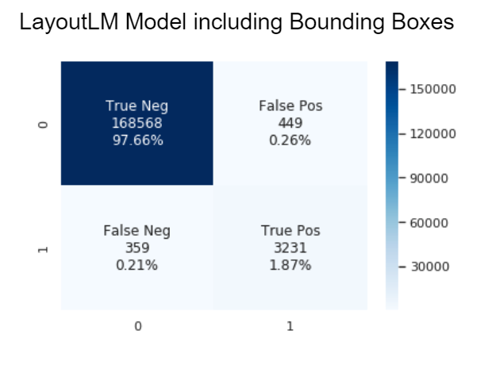

## Recap: Project Goals and Previous Updates:
Working with AppFolio, our project goal is to automate the extraction of key information from a property invoice. Whereas traditionally every invoice had to be analyzed by hand, automating the process would save valuable time for AppFolio. Given thousands of invoice images and their OCR scanned text files, our goal is to train a model that locates and identifies key information such as total charge. Although our access to the AppFolio dataset was delayed due to privacy concerns, our team has had considerable time working with the dataset since our last update. 

Our team has decided to work on two different approaches in order to compare their merits and demerits. Detectron2 utilizes computer vision to locate labels within the invoice and LayoutLM makes use of the language and relative positions of each word. Our end goal in doing this is to be able to identify the differences between a computer vision based approach and a NLP based approach.

### Name References:
NLP: Stands for Natural Language Processing. It is the study of how computers can be programmed to understand the human language.

OCR: Stands for Optical Character Recognition. It is the process of converting written/typed text info into machine text. Example use would be scanning a handwritten letter and outputting its content onto a word file.

## Update
### [Detectron2](https://detectron2.readthedocs.io/en/latest/) Update:
A few recent obstacles that we have encountered include our model not being able to output actionable insights, instead outputting nothing or just noise and labelling our data to make more accurate predictions to fit with the format wanted. Our model was outputting blank screens with no predictions, so to solve that, we expanded our model to input all the price values it detects on the invoice. This meant that we changed our data to include bounding boxes around all of the prices. Unfortunately, this still did not output anything, so we were confused about the actual model itself, which led us to explore how we were defining the model. Turns out our hyperparameters were poorly defined, so we increased epochs to let the model train for a longer time, and increased learning rate. This helped our model actually learn the data more, and we ultimately got it to recognize the prices. Although the model isn’t finished, this step takes us closer to finding the total price, which we aim to find using this model as a step.

### [LayoutLM](https://huggingface.co/transformers/model_doc/layoutlm.html) Update:
LayoutLM is a state-of-the-art Natural Language Processing model that incorporates both the words and the bounding boxes to classify each token. Note that for this model we are actually using only the OCR scan and not the image, since it’s a natural language processing and only makes use of relative positions and words, without considering how it looks. This is actually an important point because we are evidently losing valuable information that comes from the looks of an invoice, like the bold words/numbers. 
Even though the model was pretrained on a huge dataset, we still needed to finetune it to our specific application, which is like training it again with the only difference that we start from the pretrained weights. Thus, training takes much less time since all the parameters of the network already have “decent” values. Additionally, if we didn’t use a pretrained model we would have had to train with much more images and for much longer. To finetune it, we had to work on preprocessing, since the model expects the words, bounding boxes, and other parameters in certain formats. For example, we had to tokenize every word, concatenate them, and truncate the length of this “list of tokens” so that it has a predefined sequence length of 512, which is the one that the model was pre trained with. Additionally, we needed to compute the bounding boxes and labels for each token. Keep in mind that the model we used is a token classifier, which means it classifies each token, so we have to feed it with the tokens for each word for every word in the document. Essentially, our process to get a final working model looks like this:

* Load pre-trained model - model that was trained on a dataset of millions of documents.
* Preprocess our data - tokenize (encode and potentially split) it, normalize bounding boxes to a unified standard, label each token, truncating the sequence length, etc.
* Finetune the model - train the model with our own preprocessed data.
* Evaluation - check how the model performs on new data
* Further analysis - check what our model is classifying incorrectly, and what we can improve.

Until recently, we were unable to include the bounding boxes into our model, resulting a model having the following [metrics](https://towardsdatascience.com/20-popular-machine-learning-metrics-part-1-classification-regression-evaluation-metrics-1ca3e282a2ce): 

Precision: 0.88

Recall: 0.90

Accuracy: 0.995

F1: 0.89

After the inclusion of bounding boxes (which provide the relative positions of the words) into our model, it showed an overall improvement over the board:

Precision: 0.89

Recall: 0.94

Accuracy: 0.996

F1: 0.91

Note: These graphs describe the classifications of every token from every test invoice passed through the model. A positive classification shows that a token is classified as an invoice total value while a negative classification shows that a token is classified as not a total value (all other words on an invoice). That is why the ratio of negatives to positives is massive.

## Obstacles:

### Detectron2: 
An obstacle that we aim to solve is helping the model determine which price is most significant. This is because our model can recognize many prices, but the next step is to isolate prices that are important so we can slowly isolate the total price we are aiming to extract. 

### LayoutLM: 
An obstacle we are facing is that the data, both our input and validation, is not the cleanest. This is due to limitations to the current capabilities of OCR scanning (including [Google Cloud Vision](https://towardsdatascience.com/20-popular-machine-learning-metrics-part-1-classification-regression-evaluation-metrics-1ca3e282a2ce), which was utilized on our data), and problems with models used to create the validation provided to us. This potentially limits our model’s inclusivity of invoices, so we will need to address as many apparent problems in our OCR scans and validation as we can find. We have already started in this process by identifying all the invoices that are not fit to pass through to our model and storing them separately as to run tests upon them and create a pipeline as to accommodate them and/or fix our model.

## Next Steps:

### Both: 
We will be provided an additional 20,000 invoices with better ground truth files (human validated) to train our models further and to be able to see how our models work with (potentially) different invoices than the ones in our original dataset of 7,000 invoices

### Detectron2:
Our current model recognizes most prices with high accuracy, but fails to isolate the “total” value. We currently have two approaches in mind to solve this. First is to modify out boxes such that locating the “total” value becomes more obvious. Second is to deduct the “total” value by finding mathematical relationships between the prices. This second approach seems to be difficult, since our current model doesn’t have 100% accuracy on detecting price values, and even a single false value in our equation can offset the calculation for “total” value.

### LayoutLM:
- Doing a ‘stress test’ of the model to see which parameters are affecting the model more: 
- Randomizing the bounding box relative positions for each word in each invoice to determine the effect on the model prediction accuracy
- Removing some words from the invoice
In general, the tests will unveil how the neural network is actually working and will allow us to make changes accordingly. They will provide us with an intuition of what the model needs to perform well, which we will be able to use in our future iterations.
Since LayoutLM is a Transformer, it utilizes the mechanism of attention, which means it weighs the different parts of the input data. Thus, we plan to have some visualizations with the attentions to see what the model is paying attention to when predicting whether a token corresponds to the total value or not.
There are a group of invoices we have identified that contain multiple different totals for the customer to choose from instead of just one. We will insert a pipeline in our model to be able to identify such invoices and utilize the specific business logic to be able to identify which particular amount that the customer may want to pay (for eg. the minimum payment or their entire balance)
Analyze further sources of error in our model as to be able to mitigate them and further stabilize our model
