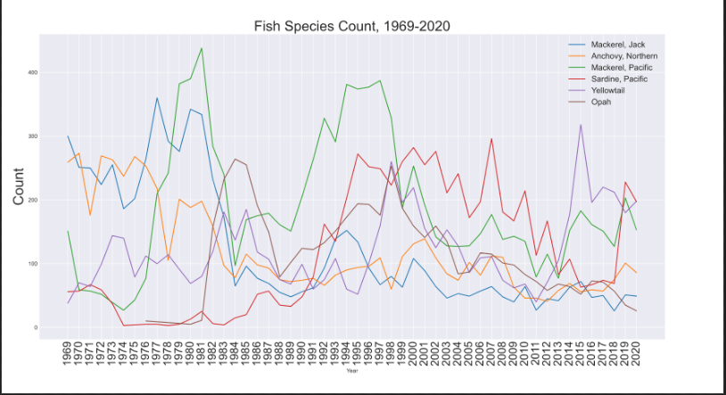
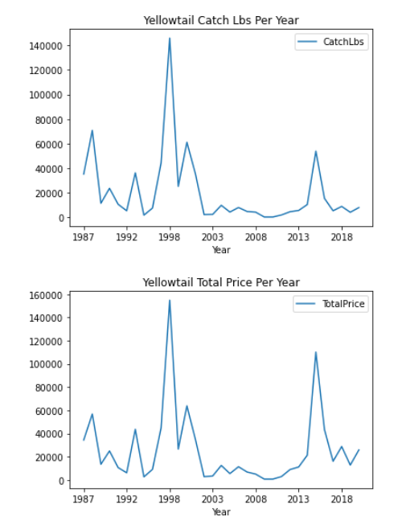
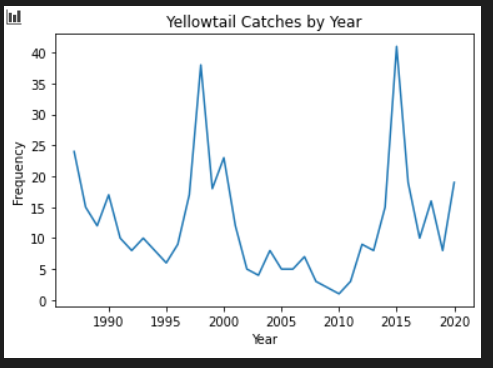
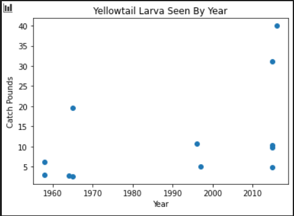

# Update 1

## Project Introduction
- CALCOFI is an organization tasked with studying the marine environment of coastal California and investigating the relationships between climate, fish population, and other human activities.
- Our project focuses on two separate information sets: fish larvae catch data from CALCOFI cruises intended to measure populations of various species, and commercial fish data from fisheries in California.
- We are seeking to establish whether any correlation can be drawn from the two datasets, as well as possibly investigate any environmental factors that add variance to the relationship.

## Summary of Datasets
- Larvae Dataset
    - A column for times, and one for every species caught
    - Very sparse dataset, since most of the cruises caught 0 of a particular species
- Commercial Fishery dataset
    - Columns for time, location, and which species was caught
    - Species are in common, rather than scientific, names so need to be converted
    - Also column for total price and pounds caught of fish
        - However, because of data privacy, much of the price/pounds are redacted (if there were very few cruises that month).
        - We are investigating whether we can aggregate the data by using less fine location information in order to get more accurate catch information

## Exploratory Findings

 - First, we took a very general look and looked at the count of species by year.

 - As we can see from the above, there is a wide range of amounts of times each species has been caught, ranging from about 5000-10000.

- We focused on yellowtail because that was the easiest one to match between the datasets, but we will expand this analysis to more species soon.

 - It was interesting that while the price and the catch pounds spiked in the same years, the catch price appeared to have an opposite relationship. Another interesting factor is that in 2015, many fisherman appear to catch yellowtail, but there is not many pounds caught.

- Another investigation we did focused on seeing whether the two datasets had any visible patterns/connections.
    - As we can see from the screenshots above, both the larva and the catches appear to have peaks around 1997, and around 2015. Further analysis, both on the environmental causes and on the statistical significance of this connection, is necessary.

- Visualization of all Yellowtail larvae identified in 2016 (purple) compared to all locations Yellowtail were caught in the years 2017-2019 (yellow blocks). The time lag was picked to give enough time for recruitment to happen, so the larvae identified in 2016 could possibly be the same fish caught in the later years. All the larvae and almost all of the catches occurred within the Southern California bight.

