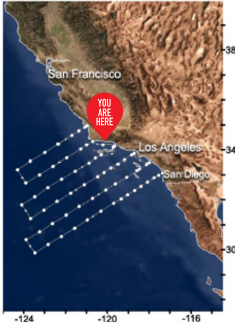
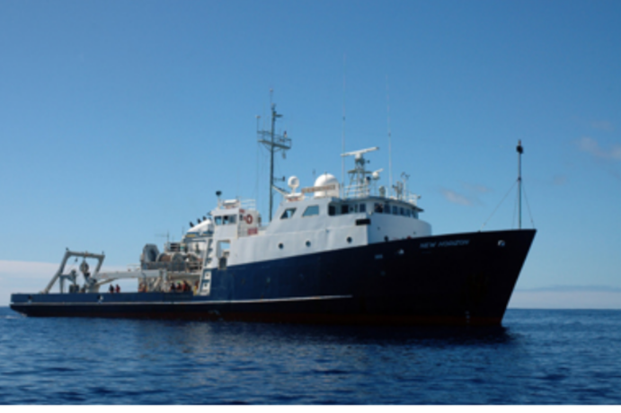

# Update 1

 

 

## Overview

Given various water characteristics over many geographic regions, we would like to correlate this to the makeup of marine life so that in the future observing the water around California's coast can give effective insight over how the makeup of marine life should be. This can be vital to preserving the environment, helping endangered marine species, and ensuring the well health of our oceans in general as well.

Our primary dataset comprises of two large time series datasets regarding many water characteristics across many regions and depths of California's coast over years of time steps, and an even larger time series dataset comprising of the topology and makeup of many species of marine life accross many regions off of California's coast. We want to find correlations between the makeup of water, and how this affects the current and future states of how marine life looks in various regions; this might change from species to species of course, and we also would like to explore the various causal factors that can be existent regarding the various water characteristics region to region, which in turn affects the makeup of marine life.

## Challenges and Obstacles

Several challenges are present with the data; the first one being that the time series dataset regarding marine life spans from the 1960s until current, which is around a 60 year span worth of data, however the water dataset is from spans from 2008-2015. Therefore the water characteristics time series need to be extrapolated backwards so that we can correlate all the marine life data to the makeup of the coastal waters at the time. We are exploring effective ways in which this could be done; currently we are exploring methods of being able to take certain proxies that might be available spanning from the 1960's and using those to extrapolate the rest of the data regarding the makeup of the water over all the time steps we desire. We are also exploring how certain water characteristics might be dictating the rest of them, and so focusing on effectively being able to determine what those characteristics would have been for the the time steps that are available in the fish dataset but missing on the water dataset could be vital in then determining the rest. 

The next challenge that arises is effectively splitting the time series data into several time series - for example, grouping each species together. However, we also need to account the fact that location and depth could affect what happens, and so we need to also split the time series up by their locations and depths. This also applies to the water dataset.

## Data Exploration

We currently are focusing on tackling the challenges of effectively splitting the time series data in the best and most helpful/effective ways possible to help us make forecasts, as well as focusing on extrapolating out the water data into the past so we can correlate it with the fish data. 

The data is collected from the areas viusualized below mainly in the coasts of california. The image of the ship below is how they collected data in the ocean for CalColfi in each station of the visualization given below.  

     

### Water Dataset

We are finding that the most effective ways to split up the water data time series are by certain groupings regarding location and depth. Having tried multiple splits, we are now finding splits that are effective in grouping correctly the different trends and seasonalities that might be occuring in the ocean due to location and depth. Due to these seasonalities and trends being evident now, we are trying to use time series forecasting algorithms to see if we can make backwards forecasts that are accurate, in order to fill in the missing timestep values from the past (pre 2008). We are focusing on being able to accurately predict what the water Tempretures and Salinity would have been, as these might influence all the other characteristics.

### Fish and Larval Dataset

The fish and larval dataset contains collections of about 100 different species found in California Coastal water. We have found that the observations go all the way back to 1904 and continue through the 2010s; this allows us to evaluate longer trends both annually and seasonally. With such an extensive dataset, we are currently dividing the dataset by season and will be initially focusing on the time that coinsides with the smaller water dataset mentioned previously. We have brainstormed ideas to focus on species that are common to the California cost and the more rare species that have only been observed a few times because they might be the strongest indications of certain flucuations in the pH and composition of the water. Another important aspect of the data to consider is the various stations where the data is collected, as physical location may also play a role in the concentration of larval fish recorded.
