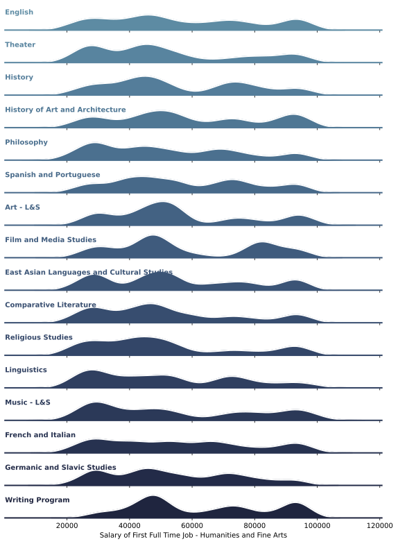

# Update 3
## Center for Science and Engineering Partnerships (CSEP) Project
```{eval-rst}
.. figure:: csepLogo.png
    :scale: 90% 
```
## Capstone Members
* Manny Medrano, Andrea Anez, Romtin Toranji, Karanveer Benipal
### Faculty
* Alexander Franks, Lubi Lenaburg, Joshua Bang

### CSEP Project 

## Introduction
The CSEP Alumni Tracking Project tracks students graduating from  2000 - 2018 from the University of California, Santa Barbara. The overall goal of tracking students is monitoring opportunities UCSB provides and the impact on student outcomes. 

The data comes from a mix of sources: online - LinkedIn, personal websites, and professional organizations - and UCSB's information about students. While not all of the data was accessed through an automated system, some of it required some manual revisions to determine if a student's data is updated. So while we collected from some of the sources listed above, there will exist some type of error whether it is a simple misspelling of a word to texts existing in an integer column. 

The organization providing the data does not have an overall goal for the outcome of the data: the CSEP group is free to explore any possible avenue for the data within reason.  

## CSEP Update 1 & 2 Summary
To be able to work with the data we need to be able to access our individual virtual machine and do our coding there. Any visuals that need to be exported from the secure portal has to be approved first by our program advisor. 

We've been able to clean up the data and fix up any corrections with empty entries, grammar, spelling, and clearing up any inconsistencies (i.e. 'Engineering' and 'ENGR'). Data has been imported externally as well to fulfill our main goal. We were able to obtain data for the socioeconomic backgrounds of UCSB freshman admits and also data for top graduate programs in the United States. This helped us correlate how impacted a major is to their socioeconomic background and what majors are going to top graduate programs (from usnews), respectively. 

Separately, we took a look at the outcomes of freshmans versus transfer students and prediciting the level of job title at 30% accuracy, 3 times better than a random guess.

Now, we're doing more analysis on logistic regression models and in the process of sharing our results on a website we create.

## CSEP Website  
The CSEP team felt it is beneficial to share the projects results with students. In order to do so, we are creating a website to display our results. The website is written using a web framework called Django. Django is a high-level python web framework that encourages reusability and scalability. Therefore, instead of having to rewrite html for every webpage, Django lets us use pages like building blocks and scale from there. 
```{eval-rst}
.. figure:: site.png
    :scale: 100% 
```
The goal is to have all of our charts and models rendered on the website. In addition, we aim to make the models and charts interactive: providing an immersive experience for site visitors.  


## Careers 
   As mentioned above, the goal of the CSEP project is to share the models and summary statistics with the students. We split
   the project into some umbrella categories which became our focus. One of these categories was careers. 

   In the careers page on the website we wanted to display all models and summary statistics we found that related to alumni
   career outcomes based off predictors such as activities during UCSB and prior background before applying to UCSB. 

   Of the models we have we wanted to share some of our findings here:

   * Current Employment:
       
       We made a logistical regression model to predict the outcome of current employment of our alumni. (For information about
       Linear Regression please reference our Methods section)
       In this model, the predictors were activities and traits that an individual had during their time at UCSB. More 
       specifically, the predictors were gender, whether or not they were an athlete, whether or not they were in greek life, 
       whether or not their major was stem and whether or no they were part of the honors program. With all of these predictors, 
       this is a summary of our findings. 
       
       Coefficients: These are the coefficients found from this model. (Please reference Methods section)
       ```{eval-rst}
       .. figure:: coeffs.png
            :scale: 70% 
       ```
       
       ```{eval-rst}
       .. figure:: prob.png
            :scale: 70% 
       ```
       
       We built this model as we wanted to give our students insight on what activities during their time here on campus would
       prove to be most impactful on current job employment based on the data we have on our alumnis.
       
   * Years till level of management: 
      
      In our dataset, we had descriptive data on our alumni's job. We had data on what level of management the alumni was     
      currently occupying. These levels of management were categorized into 3 levels - upper, midde, and lower. We gave these
      variables an inverse relationship while encoding them. We gave 1 to the upper, 2 to the middle and 3 to the lower level of
      management. 
      
      Next we used the data we had on the time they started the job and the time they were last enrolled in any level of school
      post undergrad. We took that data and found the years it took to get that current job. We multiplied that with the encoded
      level of management to build a singular y value and we used linear regression to predict the years. (Reference methods
      section for information about linear regression).

## Graduate School
The graduate school logistic regression model aim is to be able to enter your major or your field of study for gradaute school and all of the predictor categories that will be fed in to the logistic regression model. So, you will tally off if you were involved in greek life, the honors program, studying abroad, sports, and your gender. The model will give you the likelihood you are to get in a top 5/10/25 school for your field based on the CSEP gradaute data. This is connected to the top gradaute schools list based on your field from usnews on the most available year available. 

Currently what has been done is the significance of each of the predictor variables for each major. As of now, we have sampled a few majors to test out the likelihood of the logistic regression model and see how effected the predictors are at determining the likelihood of the model through their p value. 

We've also been able to look at our results a confusion matrix and ROC curves that will be described more below on their statistical definition.

# Methods 
* Logistic Regression - this model is used when the outcome that you are predicting is categorical.
     In the case of the first model, the outcome was categorical as job employment is binary. Either you are currently employed 
     or you are not employed. 
     
     * Confusion Matrix - is a table used to describe the performance of a classifying model. The values in the confusion matrix
       are true positive, true negatives, false positives, and false negatives. Based on the freuqency of these in your table, you
       can deduce the accuracy and error rate of your model.
       
     * Coefficients - The logistic regression model usually outputs log odds as coefficients. These coefs were turned into regular
       odds and they can be read as “For every one-unit increase in X variable, the odds that the observation is in (y class) are
       coefficient times as large as the odds that the observation is not in (y class) when all other variables are held constant.”

     * ROC Curve - is a graph that illustrates the performance of a classifying model. The curve plots two parameters, the tpr →
       true positive rate and the fpr → the false positive rate.

* Linear Regression - this model is used when the outcome that you are predicting is continuous.
     In the case of the second model, the out come was continuous as the number of years till the level of management can't be 
     categorized. It can take on many different values. 

## Post Graduation Earnings 

### Engineering 


### Mathematical, Life, and Physical Sciences 


### Social Sciences 


### Humanities and Fine Arts 



## Software Used
* Python
* SCRE
* Excel
