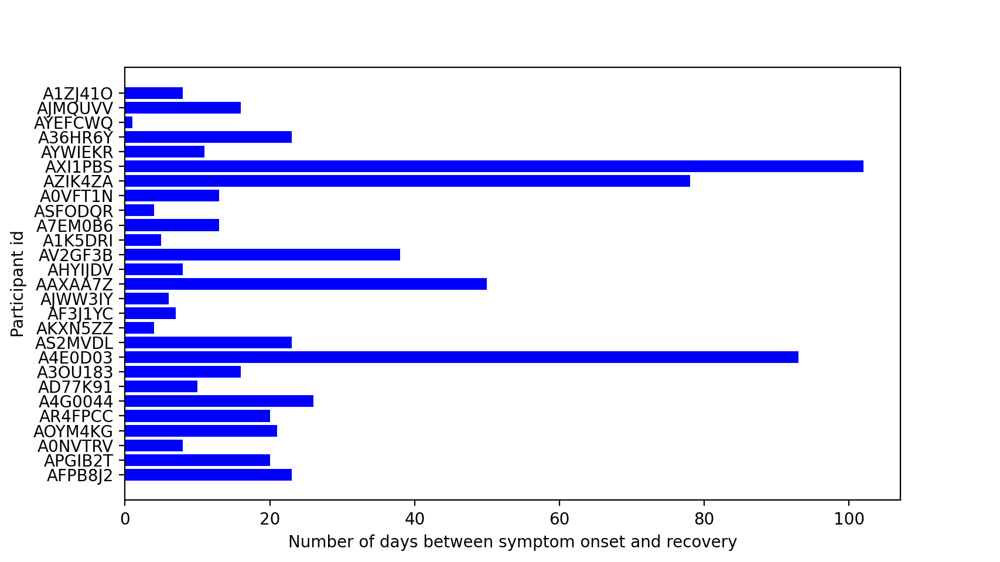

# Evidation Health Project Update 1
## Introduction
The aim of this project is to discover methods of pre-symptomatic COVID-19 detection using data collected from wearables. We are using a recent study, ["Pre-symptomatic detection of COVID-19 from smartwatch data" (Mishra et al)](https://www.nature.com/articles/s41551-020-00640-6), as the baseline for our research and the source of data for our analysis.

## Goals 
The primary goal of this project is to replicate and build upon the Mishra et al study. Namely, we aim to use the outlier detection algorithms described in Mishra et al to determine the likelihood of COVID-19 infection in an individual given their heart rate, step count, and sleep data.

Our short term goals for the project include:
* Recreating visualizations from Mishra et al
* Researching Mishra et al's HROS metric and exploring alternative metrics
* Using anomaly detection algorithms described in Mishra et al and perhaps tweaking and improving upon these established algorithms

Ultimately we are not only looking to replicate the Mishra et al study but also to improve upon it and try alternative methods (like changing time frames used in computing metrics, exploring different anomaly detection algorithms, etc.). 

A long term goal of this project is to explore regularized cross-validated linear mixed models and causal modeling and inference.

## Initial research findings
Our initial focus has been reading the Mishra et al paper and researching the methods used by the paper's authors. We also began exploring the data set which will be used for our visualizations, modeling, and analysis.

### Initial Data Dive-In 
The data set from the Mishra et al paper consists of 280 csv files. These files include an ID number (individual person of the study) with steps, heart rate, or sleep from the fit bit watch that individual wore during the period they were exposed to COVID-19. Supplementary data sets offered by the authors include each individual's symptom onset date, diagnosis date, and recovery date. For a few of the participants, we also have self-reported survey data about their symptoms.

To explore this data we create some basic visualizations. Below we’ve visualized the number of days between an individual’s symptom onset day and recovery day. Participants with missing values were excluded from this visualization. We see there's a lot of variability in the intervals: some individuals experience symptoms for just 2 days, other experience them for over 100 days.

### RHR-Diff
One area of focus in our research was the RHR-Diff algorithm cited in Mishra et al. RHR-Diff is an anomaly detection algorithm based on the [Rank-Based Scans method](https://www.tandfonline.com/doi/abs/10.1080/01621459.2017.1286240?journalCode=uasa20), which is a more general algorithm used to detect anomalies in signal and image processing data. RHR-Diff works by looking at hourly resting heart rate measures and comparing that measure with the average computed across a 28 day window. Heart rates significantly greater than that average are then flagged by the algorithm as anomalous. We intend to replicate the results of Mishra et al and see if participants in the study have anomalous heart rate measures leading up to symptom onset and diagnosis. This could serve as a basis of pre-symptomatic detection of COVID-19 and other illnesses.

### HROS-AD

The HROS-AD is a method of anomaly detection cited in Mishra et al. created to develop a method of pre-detecting covid before the symptom occurrences. This method examines when heart rate is abnormally increased, which is highly suspected to be a giveaway to contracting covid. The HROS-AD method consists of an algorithm based on heart rate divided by steps. There are two major components to the detection process. The first being the pre-processing step.  This step combines the steps and heart rate data, eliminates the possibility of divide by zero errors, creates moving averages with a 400 hour window, downsamples, and commits a z-score transformation that allows for comparison of different scores. The next step is the anomaly detection step. This labels outliers (the anomalies) and inliers. This form of detection was created to become a method to pre-determine covid contraction before symptom of test result confirmation. This was created to be a method which early exposure notifications and precautionary measures can be acted upon swiftly counteract unnecessary exposures. 

### Ethical Implications 
Our in class conversations about our ethical duties as data scientists sparked some concerning questions about the analysis which we intend to do for the greater good of the population in these unprecedented times. A major concern that was brought to our attention is the population which this analysis would assist. Our research is being conducted on individuals who have produced smart watch data. The problem with this is that only a certain fraction of the population owns a smart watch- those who can afford to buy a smart watch. If this analysis is as successful as we hope, we are assisting a small, wealthier, proportion of the population who will have early warning to covid exposure and be the first to fill hospital beds and consume covid contraction resources. These are important ethical topics we need to keep in mind as we pursue the rest of our research to assure our findings are not doing more harm than good. 
