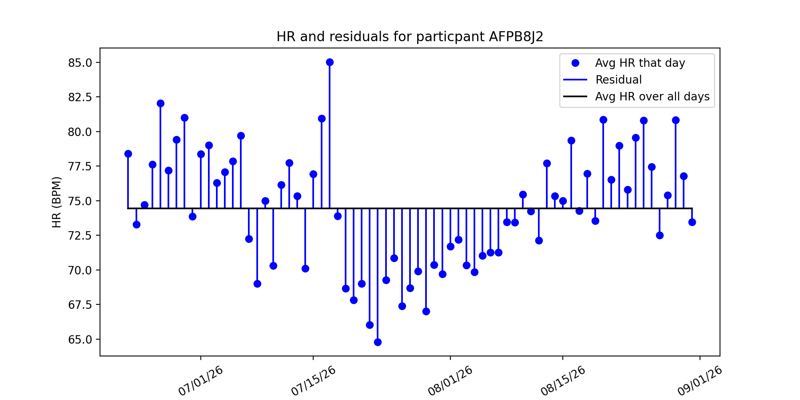
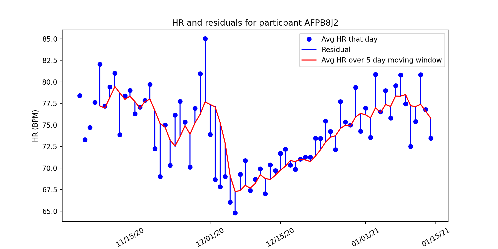

# Evidation Project Update 2 - February 21st 
## Overview
Over the past few weeks our team has been investigating a dataset used in the ["Pre-symptomatic detection of COVID-19 from smartwatch data" (Mishra et al)](https://www.nature.com/articles/s41551-020-00640-6) study. The dataset contains the heart rate, step count, and sleep data of 32 individuals diagnosed with COVID-19. Ultimately our goal is to discover methods of pre-symptomatic COVID-19 detection using this wearable data.

## Residuals 
One method of pre-symptomatic COVID-19 detection proposed in Mishra et al is to look at an individual's heart rate (HR) or step count on a given day, and compare that value with some baseline (like their mean or median HR/step count). The difference between an individual's HR or stepcount and their baseline is what we refer to as a residual. If an individual has anomalous (for example, abnormally high) residuals over a time interval, it could be a sign that they've contracted the coronavirus. So far we've explored two methods of computing the residuals: comparing HR with the average over all days, and comparing HR with the average over a sliding window.

### Method 1: comparing HR with the average over all days
We began looking at heart rate and step residuals in the most basic sense we could. This gave us the ability to see any basic trends in the heart rate, steps, and COVID-19 diagnosis. To calculate the residuals for each patient, we used the following formulas:

$$resid_{hr} = hr_t - \bar{hr}_i$$

Where $hr_t$ is the heart rate at time $t$ and $\bar{hr}_i$ is participant $i$'s average heart rate over all days. A similar method was used to compute step residuals: 

$$resid_{step} = step_t - \bar{step}_i$$

Below is a visualizations of participant AFPB8J2's heart rate and residuals computed using this method. Each blue dot is the participant's average HR that day, and the red line is their average HR over all days. The blue lines represent the residual value of heart rate described in the equations above:

</img>

Method 1 is naive because we are assuming that every patient has an overall average heart rate. This means we assume this average even when the patient is sitting, sleeping, exercising, etc.. This differs from [Mishra et al.](https://www.nature.com/articles/s41551-020-00640-6), where the average heart rate for each patient was a moving average calculated on a 28 day time interval. Using this naive approach allows us to see if there are any basic trends and do comparisons to the methods used by Mishra et al., further giving us an understanding of choices they made in the creation of their detection algorithms. 

### Method 2: comparing HR with the average over a 5 day window
An alternative method is computing the average heart rate over a 5 day window.:

## Data Updates

### Data Resolutions

In this most recent update, we took the data, which was recorded every 1-second (we call it “1-second resolution”), and reduced it to the following resolutions, taking the mean of the heart rate and steps over the time interval.

|Resolution       |# of Observations   |
|---    |---    |
|1 second       |38,946,869 |
|1 minute       |6,024,988 |
|5 minute       |1,207,809 |
|30 minute       |202,721 |
|1 hour       |101,623 |
|1 day                 | 4,353     |

As we can see, making the data less granular allowed us to greatly reduce the size of the data, making it easier for us to compute residuals. In computation of the residuals from the previous section, we decided to use the 1 hour residuals and 1 day residuals to make computations as fast as possible. 

### Future Work on data

Next goal with the data is to parse out dates from the symptoms which are in a string format using regular expressions and the `datetime` module in python. Until this point, we have not been able to work with some of the symptom data because of unusual formatting. As we try to determine more relationships between the data, this data will be important, especially when one-hot-encoded (0=healthy, 1=symptoms, 2= sick), we will be able to use the data with already existing classification methods on top of creating our own methods.
 
