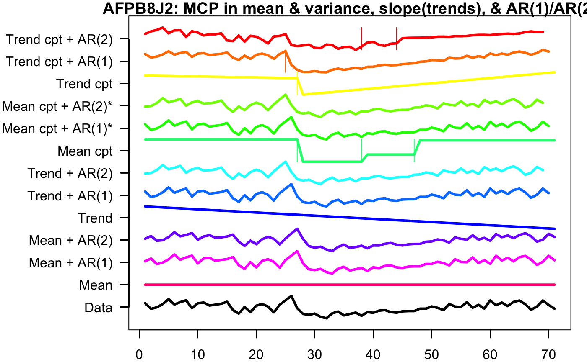

## Data

### One-Hot Encoding
We one-hot encoded our patient data into two groups: 0=no COVID and 1=COVID. This feature was created by taking the patient’s **first COVID diagnosis date** and **last COVID recovery date** and comparing it to the observations date. If the date fell between the diagnosis and recovery date, then the patient was marked with a 1, and if the date fell outside of the interval, the patient was marked with a 0. 

### Sleep Metrics
Our most recent work used sleep data, which was reported as sleep stages (awake, light, deep) and sleep stage durations (in seconds). We aggregated the daily sleep stage durations to create a feature `sleep_duration` for each patient.

## Models
One of the goals of our project is to develop models that predict COVID-19 symptom onset using an individual’s heart rate, step count, and sleep data. So far we’ve explored offline learning approaches. An offline model assumes the individual contracted the coronavirus, and considers all data leading up to and after the individual’s symptom onset. These models are not used for real time prediction of COVID-19 infection (this would require an online learning approach). Instead, we are developing them  to better understand how COVID-19 affects the physiology of an individual. 

So far we’ve taken two modeling approaches: a logistic regression model, and a multiple change-point detection method.

### Logistic Regression
One of the models we explored was a logistic regression model. We created 3 different models using different features: One used heart rate residuals for each patient, another used the Heart Rate Over Steps (HROS) feature we created, and the last used the sleep duration for each night.  Our response was whether someone had COVID (covid=1) or not (covid=0). We train-test split the data 80% train 20% test. Each observation in our dataset corresponded to one day. The model had high precision with a value of 1, meanwhile the recall was lower. This occurred because there was a large class imbalance in our data. Most of the observations for patients were when they did not have a COVID diagnosis, resulting in only a small amount of positive observations, meaning some of our test-sets did not contain any positive predictions. Out of the 5477 observations we had, 5135 observations did not have the patient marked for COVID, and 342 had the patient marked with COVID. Changing the prediction threshold for the model and using class weights did increase the number of positive (covid=1) predictions, but negatively affected the accuracy, precision, and recall of the model. This gave us more justification to use the multiple change-point detection discussed later in this section.

### Multiple Change-point Detection
We also took an unsupervised approach to COVID-19 detection. In particular, we used the multiple change-point detection method to find points in the heart rate time series data with abrupt and significant changes. We were interested in whether or not the MCP algorithm would pick up on abnormally low or high heart rates near symptom onset or diagnosis.

Using the envcpt function on Rstudio, we tested many different methods of multiple change point detection on one of the participant’s, AFPB8J2,  heart rate pre COVID, during COVID, and post COVID. 

The top 12 lines are the different multiple change point algorithms, with most of them being two methods added together. ‘Trend cpt + AR(2)’, ‘Trend cpt + AR(1), ‘Trend cpt’, and ‘Mean cpt’ have horizontal lines that indicate the different change points. Therefore, we used these four methods to record the first changepoint of every participant who contracted COVID.

Below is a visualization of the time points (colored in orange) produced by the mean MCP method. So, orange dots are points in which the algorithm detected significant changes in heart rate. Because this algorithm returns multiple change points, we’ve only visualized the first: 

We can see that the first change point is usually somewhere in a participant’s symptom interval, but its closeness to symptom onset/diagnosis varies. Upon further investigation we’ve found that the change points are generally closer to the diagnosis date than the symptom onset:

** Note: the means are heavily influenced by 3-4 outliers. One individual’s cp is over a year away from symptom onset/diagnosis date … this inflates the mean and makes the median a better descriptor of model performance.

These initial statistics indicate that our current method of choosing change points does not result in a useful method of pre-symptomatic detection of COVID-19. For example, the first change point outputted by the Meancptdate model is on average 2.5 months away from the symptom onset day. 

However, we’ve only considered the first change point detected by the algorithm. Perhaps a different method of choosing change points (such as choosing the change point associated with the most significant variation in the time series data) will lead to better results.

## Sleep :
  
The goal of our team was to examine the sleep data, which was derived from individuals who wore their fitbit at night to record their sleep, to discover an indicator or pattern in their sleep that is significant to their covid onset date. This was done in an effort to see how sleep is affected by contracting the coronavirus. There is research that indicated that overall sleep duration increases after an individual contracts coronavirus. We started the analytics process by creating exploratory plots which examine the sleep stages and the duration of the sleep stages for the individuals. 

The first exploratory plots display the contrast in the sleep stages of the individuals. Three individuals with differing data were chosen to show the contrast. 

  
The next exploratory plot shows the average duration of a sleep cycle (light, deep, wake, restless, etc.) for each day. These exploratory plots show how there is a gap in the data for some individuals. This is because only several days of data is recorded for some, while months of data is recorded for others. 

This graph shows a cumulative bar for each of the stages by day. This does not show the order which the stages occur, but helps give a broader view of the type of sleep an individual has by day. 

  
From this point, we examined our exploratory plots as a team and decided to move forward with examining sleep stage by day. This visual stacks the sleep stages by day and the x-axis displays the number of seconds that each stage lasts. 

This graph displays all days which are recorded for the individual's sleep. The days in red are highlighted because they are the days which the individual contracted covid. The goal of these visualizations was to see if there was any significant difference when the individual contracted covid.  
  
 

  
  
