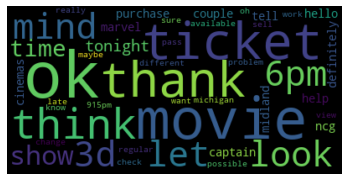
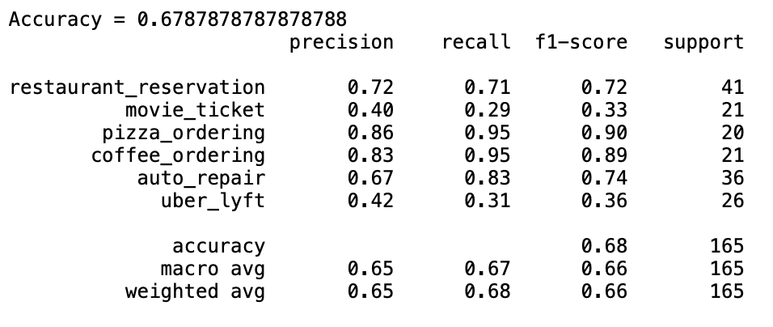
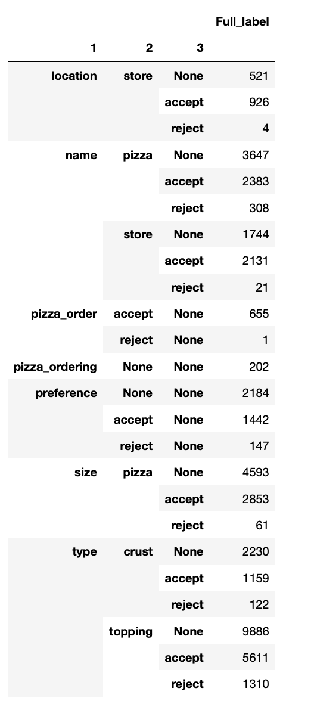

# Update 2

## Parsing Conversation and Label Data:

## Word Cloud:
No Pre-Processing:

Pre-Processed:

## Modeling:

### LDA Visualizations:

We ran an LDA on our dataset in order to better understand it. LDA is a generative model that that treats a topic as a probability distribution over a set of words and a document as a probability distribution over a set of topics. The model takes in a number of topics and calculates the distribution of words for each topic. Since our dataset contains 6 classification categories, we initially tried to get 6 topics, but it was difficult to get coherent and well separated topics. Eventually it became clear that 5 topics are best to describe our dataset. Our initial topic model includes only the text tagged as spoken by the “USER” since that’s the kind of speech we want to model. This model can be visualized below: 

      
We trained another topic model, this time including common phrases by using Gensim’s collocation detection (gensim.models.phrases). We tried this to see if it would help the model disambiguate between two categories and find 6 well separated topics but this did not happen. Instead, we ended up training another 5 topic model. Visualization below :
.
      
After we got these topic models, we started playing with the idea of using them as features for classification. This would be done by getting the topic distribution for each document and using those five probabilities as features. After doing some cross validation we arrived at a Random Forest model and a logistic regression model with roughly the same accuracy. Model performance is broken down below: 

      
Although the Random forest algorithm seemed to perform best in our cross-validation, once applied to the test set the accuracy was reduced significantly. The logistic regression model seemed to generalize much better. Our topic model features are also much more accurate for some categories than others, which makes sense given the fact that we only have 5 topics and 6 classification categories. Uber and Lyft is by far the most problematic category for both models, indicating that our topic features are not capturing that category at all.
      
Nested Json Label
Our data is in a nested json format which has made it difficult to extract and work with the labels that are nested inside individual lines of a conversation. The data is a list of dictionaries which contain each line. Some of these lines have a key “Segments”, which contains a dictionary where under “annotations” there is another list of dictionaries containing the labels under the key “name”. These annotations are labels of up to four levels that are separated by a period. These levels represent increasingly fine-grained information about the line in question. In order to understand the distribution of these labels better. We created a pandas groupby object to understand how these levels are distributed. One thing that we found is that some of the labels are independent of each other while others are not. For example “accept” and “reject” is a label that occurs under almost every category at any level past the first two, but “pizza” is one that only appears under relevant categories (mainly “pizza-ordering”). As we go forward we need to make decisions about which of these labels we want to use and understand how they pattern in order to know how to model them as categories. 

### Hugging Face API:
Did some exploration with the Hugging Face API and directly using the pretrained transformer models, which is mainly based on the multi-head self attention mechanism that replaces the original recurrence. Also gained some experienced with BERT: specifically using distilled BERT with pretrained weights and embedding.

## React Frontend/Backend Basics:
