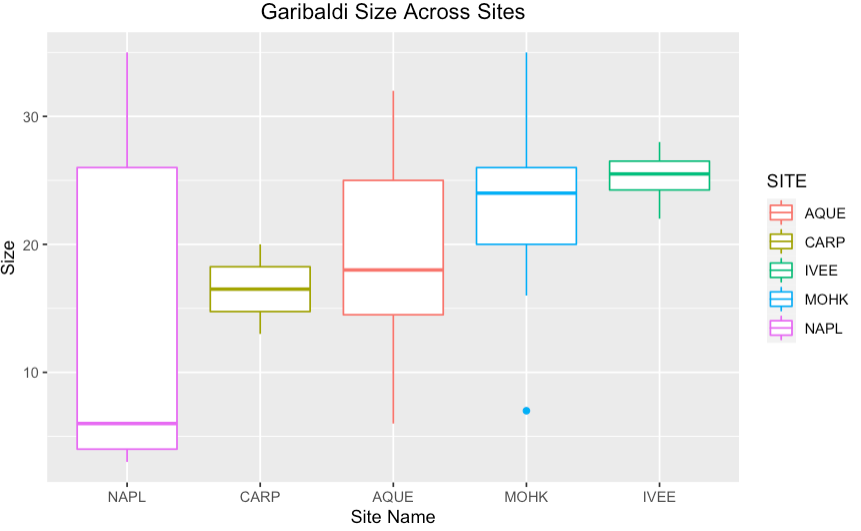
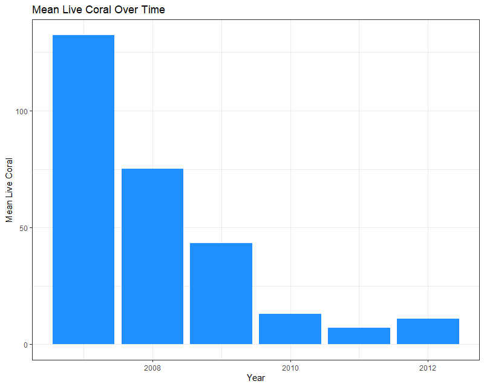
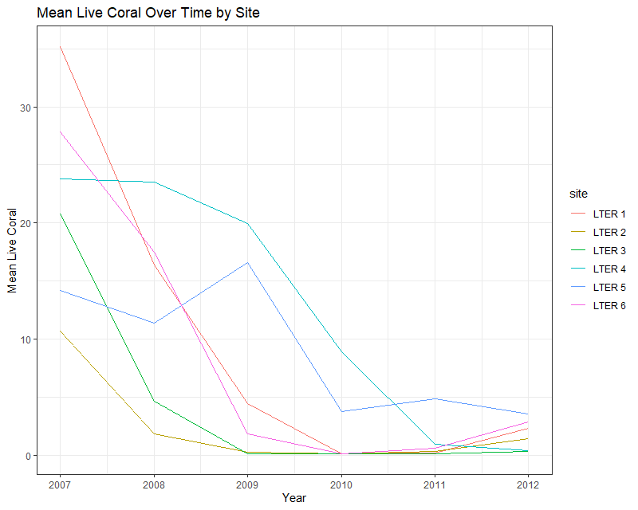
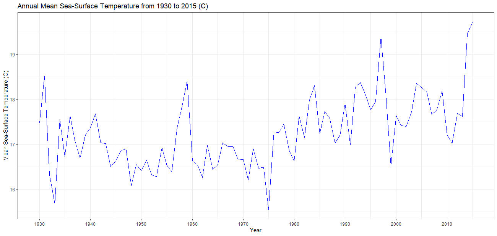
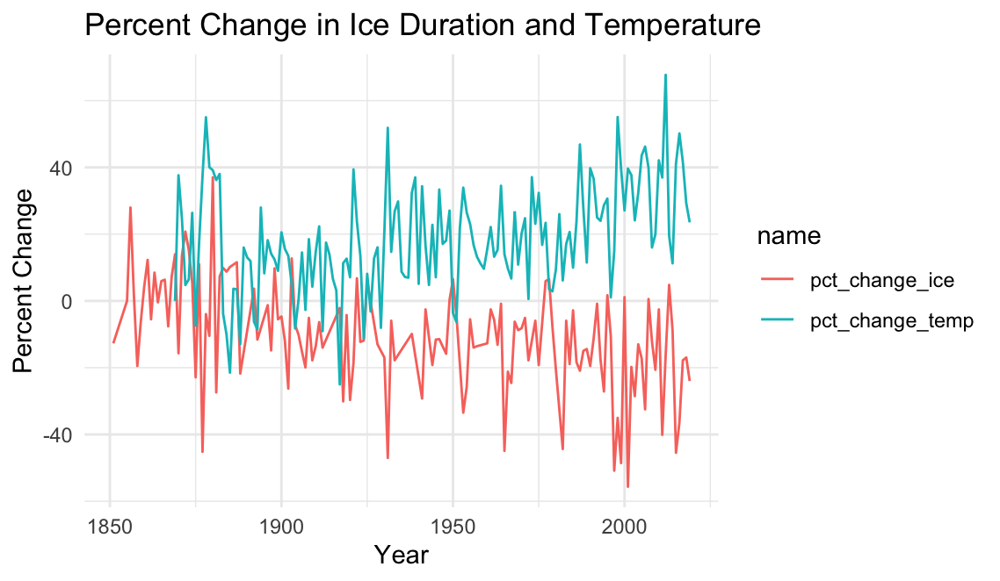

## Update 2
February 28, 2021

### Long Term Ecological Research (LTER) Datasets: R package
**Project Sponsor: National Center for Ecological Analysis and Synthesis (NCEAS)** \
**Team Members: Sam Guo, Adhitya Logan, Lia Ran, Sophia Sternberg, Karen Zhao**

#### Progress
- Began coworking hours on Fridays in addition to our weekly meeting on Mondays to collaborate, share ideas and troubleshoot.
- Learned the workflow of creating an R package from scratch based on this [example](https://github.com/isteves/r-pkg-intro ), such as creating documentation, licenses, github repositories, and functions using the say_aloha, devtools, and use_this packages.
- Incorporated what we learned in past weeks, such as the github, tidyverse, and metajam workflows.
- explored interesting datasets from LTER sites to create vignettes in our R package 
- Large importance placed on the creation of vignettes and their audiences.
- Presenting our demo packages and vignettes during our weekly meetings to update the group and to receive feedback. 
- Our installable R packages can be found here:
    - Adhitya: [Adhitya's Package](https://github.com/adhil0/alohaal)
    - Sophia: [Sophia’s Package](https://github.com/sophiasternberg/fcess)
    - Karen: [Karen’s Package](https://github.com/karenezhao/alohakez)
    - Lia: [Lia’s Package](https://github.com/liaaaaran/mcrcoral)
    - Sam: [Bonanza](https://github.com/TokyoExpress/bonanza)

###### Examples of our vignettes:

**Sophia** \
I worked with a Fish Abundance dataset from the SBC (Santa Barbara Coastal) LTER. This dataset is particularly interesting because researchers record the date, site, fish type, and length. I chose this visualization of garibaldi fish due to the variety of its recorded length across multiple sites within SBC. The disparity in garibaldi fish length could be due to actual differences or also due to inconsistency in researcher's measuring techniques. This is a great real-world example for future data science students to learn from due to these clear, inherent differences. The fish abundance dataset is extremely workable and had a lot of promise for future analysis.
 

**Lia** \
I choose a dataset from the Moorea Coral Reef site that analyzes the changes in abundance of fish functional groups in relation to live/dead coral. My initial visualization was to showcase the obvious: how live coral rates decrease over time. Then, I plotted this per site to maybe account for biases in the data that were unobserved otherwise. We concluded that coral rates continue to decrease (yet as a slower rate), despite what the initial visualization might imply. 

**Karen** \
The dataset that I worked with is daily sea-surface temperature measurements, collected from the end of the Scripps Pier at the sea surface and a depth of about 5 meters. The location makes data collected here quite representative of oceanic condition. This plot below shows how the annual mean sea-surface temperature from 1930 to 2015 has been increasing. \

This dataset is from the California Current Ecosystem (CCE) LTER. CCE is a coastal upwelling biome, located off the southern coast of California. Because there is a long record of observations and a rich data set from this region, many of the studies conducted here focus on changes in the ocean ecosystem. This includes a long term ocean warming trend, which can have biological effects on plankton production, fish catch and seabirds. It is also associated with changes in sea level, wave heights and beach erosion. Scientists are just beginning to learn the details of the linkages between all these processes.\

**Adhitya** \
This plot shows the percent change in the amount of days that lakes in Madison, WI were frozen each year, as well as the percent change in the mean annual temperature in Madison, WI. This data is from the Northern Temperate Lakes (NTL) LTER. 

It’s important for researchers to study if there are disruptions to lake ecosystems, as this can have ripple effects for the rest of the local environment. If there are disruptions, understanding the reasons behind them can help scientists mitigate these effects. To demonstrate this, data containing the length of time that Lake Monona, Lake Wingra, and Lake Mendota were frozen every year was merged with daily temperature data for Madison, WI. The lake data was averaged across all three lakes to create a single measurement for each year, and the temperature data was averaged across each year to obtain a mean annual temperature. Then, all measurements were compared with the earliest entry for both categories by computing the percent change for each year. As a result, the change in ice duration over time could be compared with the change in temperature over time on the same set of axes. 

The plot shows that, over time, the average temperature in Madison, WI is increasing and that the amount of time lakes in Madison are freezing for every year is gradually decreasing. Additionally, there are several years where a spike in temperature seems to have a corresponding decrease in ice duration. From these observations, it is possible that there is a correlation between temperature and the ice duration of lakes. In the future, time series analysis could be conducted to quantify the correlation between the two variables.

#### Future Plans
- For the remainder of this quarter, we plan to refine our packages and vignettes even more, while adding more in-depth descriptions and other important metadata about our packages. To do this, we will need to know our datasets inside and out and understand every nuance. 
- Start deciding which datasets we will import to our final product and map out a plan of how to best collaborate on this. 

