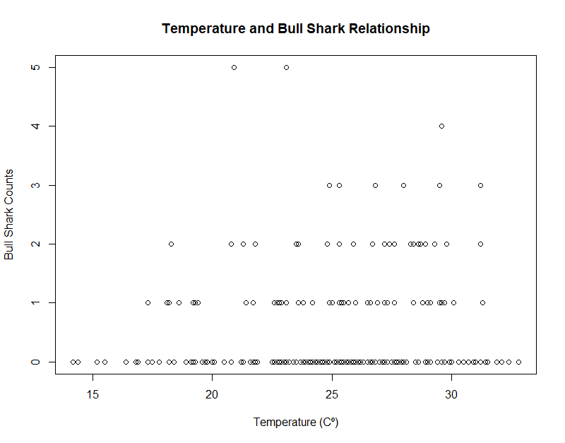

## Update 2
February 28, 2021

### Long Term Ecological Research (LTER) Datasets: R package
**Project Sponsor: National Center for Ecological Analysis and Synthesis (NCEAS)** \
**Team Members: Sam Guo, Adhitya Logan, Lia Ran, Sophia Sternberg, Karen Zhao**

#### Progress
- Began coworking hours on Fridays in addition to our weekly meeting on Mondays to collaborate, share ideas and troubleshoot.
- Learned the workflow of creating an R package from scratch based on this [example](https://github.com/isteves/r-pkg-intro ), such as creating documentation, licenses, github repositories, and functions using the say_aloha, devtools, and use_this packages.
- Created three of our own demo datasets, two where the data was provided for us, and one where we chose our own dataset from any LTER site. 
- Incorporated what we learned in past weeks, such as the github, tidyverse, and metajam workflows.
- Large importance placed on the creation of vignettes and their audiences.
- Presenting our demo packages and vignettes during our weekly meetings to update the group and to receive feedback. 
- Our installable R packages can be found here:
    - Adhitya: [Adhitya's Package](https://github.com/adhil0/alohaal)
    - Sophia: [Sophia’s Package](https://github.com/sophiasternberg/fcess)
    - Karen: [Karen’s Package](https://github.com/karenezhao/alohakez)
    - Lia: [Lia’s Package](https://github.com/liaaaaran/mcrcoral)
    - Sam: [Bonanza](https://github.com/TokyoExpress/bonanza)

###### Examples of our vignettes:

**Sophia** \
This image shows an initial view of the Bull Shark Count Overtime. This data is from the Florida Coastal Everglades (FCE) LTER Site. I thought this was an interesting plot to include because of the pattern happening YoY. 

The second image shows the relationship between Temperature and Bull Sharks. I thought this was important to include because it brings up an important point about the nature of collecting data and taking data with a grain of salt. From a first glance, it appears that more Bull Sharks are counted when the Temperature is higher; however researchers are also more likely to survey when the Temperature is warmer/nicer and that may be a bias in the data and affect the number of Bull Sharks counted.

**Lia** \
I choose a dataset from the Moorea Coral Reef site that analyzes the changes in abundance of fish functional groups in relation to live/dead coral. My initial visualization was to showcase the obvious: how live coral rates decrease over time. Then, I plotted this per site to maybe account for biases in the data that were unobserved otherwise. We concluded that coral rates continue to decrease (yet as a slower rate), despite what the initial visualization might imply. 

**Karen** \
I chose to study a dataset from the California Current Ecosystem (CCE) LTER. CCE is a coastal upwelling biome, located off the southern coast of California. Because there is a long record of observations and a rich data set from this region, many of the studies conducted here focus on changes in the ocean ecosystem. This includes a long term ocean warming trend, which can have biological effects on plankton production, fish catch and seabirds. \
The dataset that I worked with is daily sea-surface temperature measurements, collected and provided by the Shore Stations Program, La Jolla CA. The raw data contains more than 36 thousand entires. 

**Adhitya** \
This plot shows the weight distributions of pikas found at various sampling sites in the Niwot Ridge LTER:

#### Future Plans
- For the remainder of this quarter, we plan to refine our packages and vignettes even more, while adding more in-depth descriptions and other important metadata about our packages. To do this, we will need to know our datasets inside and out and understand every nuance. 
- Start deciding which datasets we will import to our final product and map out a plan of how to best collaborate on this. 

