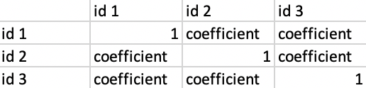
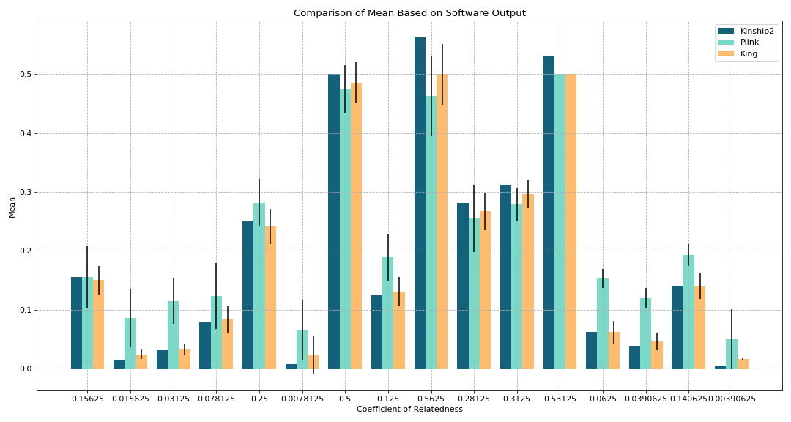
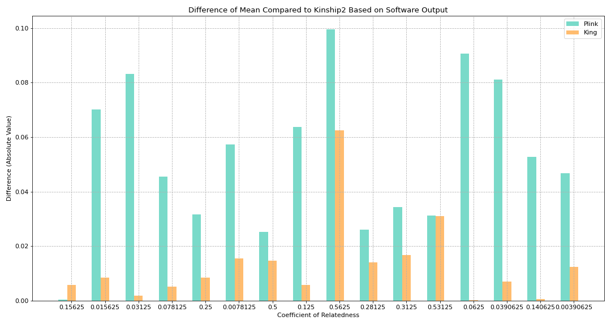
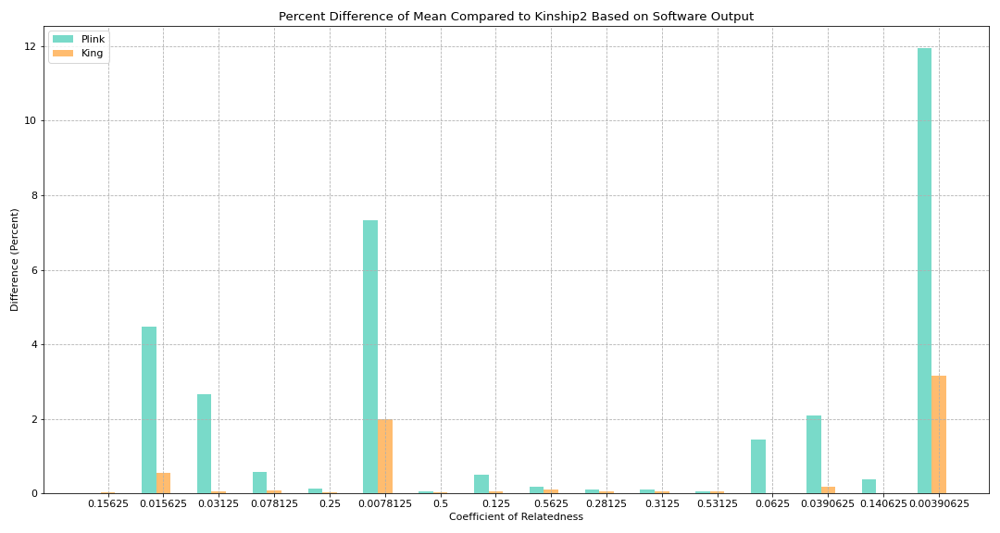
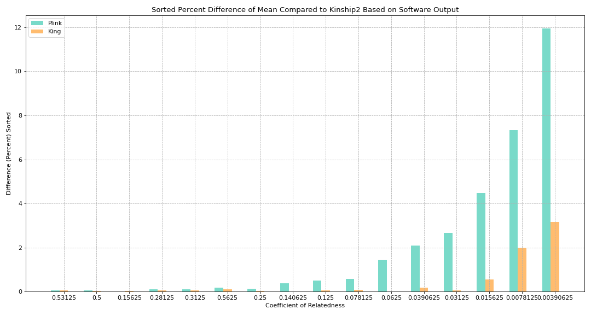
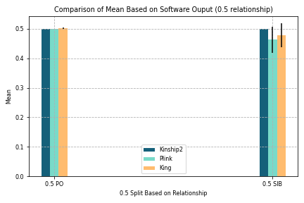

# NRI - Update 2
February 28, 2020

Helen Huang, Shivam Misra, Priya Padmanabhan, Surya Pugal,  Yixiao Yue

## Summary

We are given .bed/.fam/.bim data about individuals whom we have pedigree information for. We will feed the data into King and Plink program to calculate coefficients of relatedness (what percentage of genes between a pair of individuals is the same). Based on the percentage, we can tell whether two individuals are first degree, second degree, or not related. We will use the Kinship2 software which produces a pedigree object and output coefficients of relateness. Comparing the King and Plink values to the theoretical values produced by Kinship2, we can compare the accuracy of both of the softwares.

**Coefficient of Relatedness**
* Percentages of genes between a pair of individuals that are the same
* Larger value typically means closer relationship
* Examples:
  * Parent-Offspring (OP): 0.5
  * Full siblings: 0.5
  * Half siblings (ex. Relationship between 2 children with same mother but different father): 0.25
  * Avuncular (ex. Relationship between a uncle and his sister's children): 0.25
  * Cousins: 0.125

## Data Processing

### King & Plink Results

**Summary**

Using the .bed/.fam/.bim data, we fed the data into these two programs, and used the linux command line to produce 2 output files.

Command for King : ` king -b InputFilename.bed --related --prefix OutputFileName `

Command for Plink : ` plink --bfile InputFileName --genome --nonfounders --out OutputFileName `

One notable thing is that for the plink command, the filename do not need any extensions.

**Format of King Outputs**

The output file has .kin extension. Each row compares the DNA of 2 individuals from the same family. We are interested in the column named "PropIBD" because it is the coefficient of relatedness. The column named "InfType" also provided useful information that infered relationship type based on PropIBD values.

**Format of Plink Outputs**

The output file has .genome extension. Each row also compares the DNA of 2 individuals from the same family. The content of the columns are different, but the coefficients of relatedness information is still there, named "PI_HAT" this time.

**Challenges**

While seemingly straight-forward at first, this task did not go smoothly. When we ran the command on our own computers, the execution always got stuck, which led us to conclude that our computers did not have enough CPU power for it. Then we set up to ssh to CNSI (California Nanosystem Institute) computers. Unfortunately, it got stuck on those computers as well. Strangely, our mentors were able to run the commands when they ssh to CNSI computers. The problems ended up being the version of the software. We downloaded the latest version which had a bug. We got an older version, and were able to got the outputs successfully.

### Kinship2 Results

**Summary**

Given the .bed/.fam/.bim data for multiple inviduals in the same family, we were asked to feed in the data into Kinship2 in order to produce a pedigree and calculate the coefficients of relatedness. This value is the percentage of genes between a pair of individuals that is the same. We then had to compare the values produced by Kinship2 with what came from the King and Plink software.

**Introduction of The Package (Kinship2)**

Kinship2 is a package in R. Accoriding to its official documentation, it is a routine to handle family data with a pedigree object. It can be used to create correlation structure that can describe family relationships, draw pedigrees focusing on producing compact layouts without intervention, trim the pedigree object with various criteria, and so forth.

For our project, we fed in the data containing family relationship and disease carrying information. With the help of Kinship2, we were able to produce the pedigree and obtain the theoretical relatedness coefficients for all pairs of individuals in the family.

**Kinship Coefficient vs. Relatedness Coefficient**

What we got from Kinship2 are the kinship coefficients. To get the relatedness coefficients, we needed to multiply the kinship coefficients by 2:

Relatedness Coefficient = Kinship Coefficient * 2

In comparison to relatedness coefficient, the kinship coefficient is defined as the probability that a pair of randomly sampled homologous alleles are identical by descent (IBD, see Update 1 for definition). In simple words, it is the probability that an randomly chosen allele selected from individual 1 and an allele selected at the same autosomal locus from individual 2 are IBD. Because humans are diploid, meaning that cells contain 2 copies of each chromosome, we need to multiply the kinship coefficient by two to get the relatedness coefficient.

**Format of Output**

Our output file produced a matrix in a similar format to the structure shown below. For example, row 3 column 2 and row 2 column 3 both contain the kinship2 coefficient of the pair id1 and id2. The values on the diagonal are all 1s because they represent the relationship  of an individual to themself. After removing the individuals who were not directly part of the family, our file reduced to a 29 by 29 matrix.

**What We Did**

1. Created a .ped (txt) file which contains the information for all the PSEN1 family members. Each individual has the information of family id, individual id, paternal id, maternal id, sex id, and phenotype info
2. Used R to read in the .ped file
3. Created a pedigree structure and plotted it
4. Created the Kinship2 coeffcient matrix
5. Multiplied all of the values by 2 (see above for why)
6. Removed all of the rows who were not fully sequenced (i.e. the individuals that we do not have their entire genome/DNA sequence)

## Data Analysis

### Comparison between Theoretical vs. Observed

Upon obtaining all the pairwise coefficients of relatedness produced by Plink and King, we compared them with the theoretical coefficient of relatedness produced by Kinship2. We analyzed them using several bar plots in order to get some insights of both the softwares we were using and the individuals/family members we were studying.

**Workflow**
* Using Kinship2 theoretical values, we divided the pairs into 16 groups where each group has a unique coefficient of relatedness (ex. All pairs with coefficient of relatedness (produced by Kinship2) equals 0.5 were grouped together)
* For each of the 16 groups, we calculated the mean and standard deviation of the coefficients produced by Plink, as well as those produced by King
* We compared those mean values with the theoretical values produced by Kinship2 (See **Figure 1**)
* We then calculated the absolute difference between Plink mean values and Kinship2 values, and between King mean values and Kinship2 values (See **Figure 2**)
* We further calculated the percent difference between Plink mean values and Kinship2 values, and between King mean values and Kinship2 values (See **Figure 3**)
* Knowing how Plink and King performed in comparison to Kinship2, we wanted to analyze how they performed compared to each other. We sorted the percent difference plot using the difference between Plink's percent difference with Kinship2 and King's percent difference with Kinship2 (See **Figure 4**)
* Since the same coefficient of relatedness value can include several types of relationship, the group with the same coefficient can be further broken down (ex. 0.5 group contains both parent/offspring and siblings relationship). We broke down the group with coefficient equals 0.5 and further analyzed how the softwares performed on each of the relationship (See **Figure 5**)

Note: Detailed rationals of why we did such analysis and created such plots, and detailed analysis of what we found out of those plots are explained below each figure

**Consanguineous Couple**

In this family, there is a marriage among relatives. There exist a couple who are cousins, meaning that they are descended from the same common ancestor. Exact individual id numbers are not shown to protect privacy. According to our analysis, Plink and King were giving interesting results whenever the individuals in the pairwise relationship are connected to this consanguineous couple in some ways, such as the children of this couple, the cousins of this couple, etc. We will be referring to this couple in the analysis below.

**Figure 1. Comparison of Mean Based on Software Output**

This graph visualizes how the outputs of all 16 relationship coefficients vary based on the different softwares. The goal was to see how the mean of outputs of the Plink software and King software for each coefficient compare with the theoretical values produced by Kinship2. The black error lines on the graph represent the standard deviation. The coefficient of relatedness 0.53125 does not have a standard deviation line because amongst that coefficient, all of the values produced were very similar to each other.

**Figure 2. Absolute Difference of Mean Compared to Kinship2 Based on Software Output**

Based on this graph, it is clear that King produced results which had a smaller difference from the theoretical value compared to Plink (except for when the coefficient of relatedness is 0.15625). The 0.15625 coefficient seems to cover most relations involving the couple who are cousins. For example, looking at the pair including the child of this couple with any of their cousins results in this relatedness value. The coefficient relatedness value 0.53125 produced King/Plink values whose difference was fairly close to each other. This value represents and parent offspring relationship under the couple who are also cousins.

**Figure 3. Percent Difference of Mean Compared to Kinship2 Based on Software Output**

In addition to the absolute difference, we calculated the percent difference. This allowed us to visualize the differences between what King and Plink produced, irrespective of the Kinship2 theoretical value. This graph shows how the percent of difference between King and Plink with some coefficients is more drastic and obvious in some coefficients over others.  In order to get more insights, we sorted the graph so that the coefficients are ordered based on an increase in difference (see Figure 4 below).

**Figure 4. Sorted Percent Difference of Mean Compared to Kinship2 Based on Software Output**

We found a pattern where the closer relationships (such as parent/offspring and siblings) had much more similar King/Plink values compared to more distant relationships (like an individual with their great-aunt). There are certain coefficients that do not fall in this pattern (such as 0.3123 having a smaller difference than 0.5625). We hypothesize that considering how the differences between King and Plink are very small with the coefficients that are slightly out of order, it might be negligible. This is something that we need to keep in mind when working with the software later and also hopefully dive into deeper so we can test our hypothesis.

**Figure 5. Comparison of Mean Based on Software Output (0.5 Relationship)**

Because the coefficient 0.5 comprises of both parent/offspring relationship and a sibling relationship, we split it up based on each category. We did not split other coefficients that are shared between different relationships because 0.5 is very closely related and therefore, impacts our findings more. Because both parent/offspring and sibling relationship are very common, we wanted to split them to further analyze the software's behavior on both in order to go deeper on the outputs of the software. We found that the values produced by Kinship2, Plink, and King were are more similar for parent/offspring than that for siblings.

## Visualization

## Future Vision
