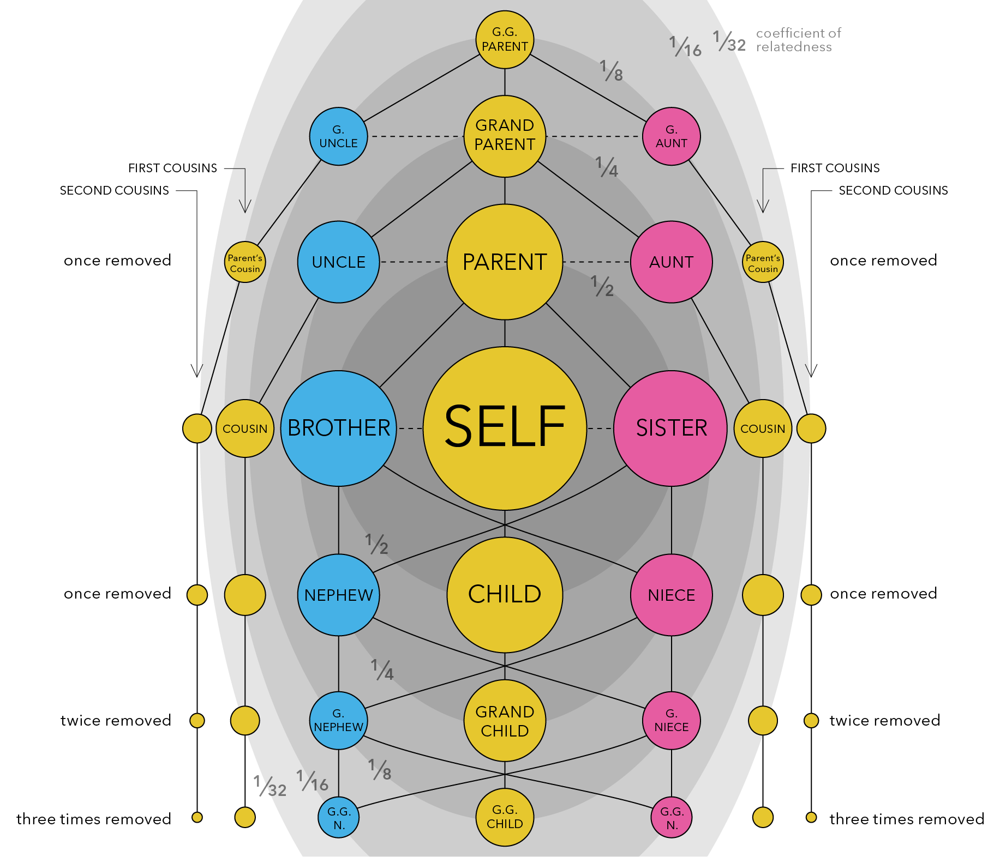
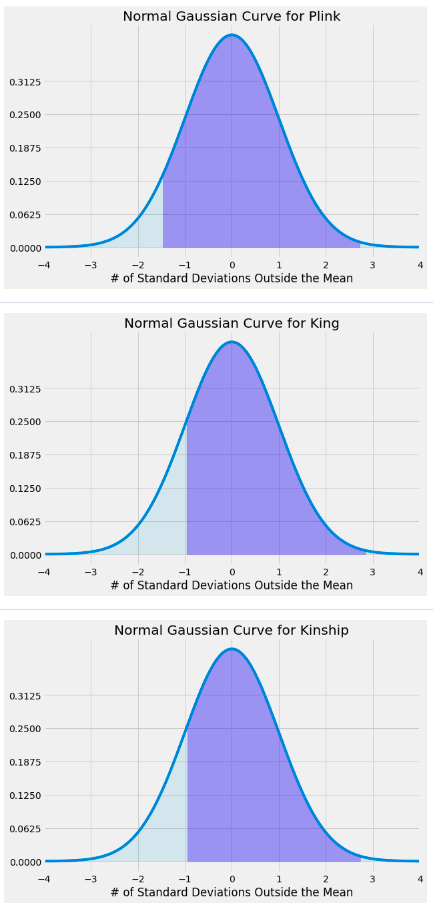
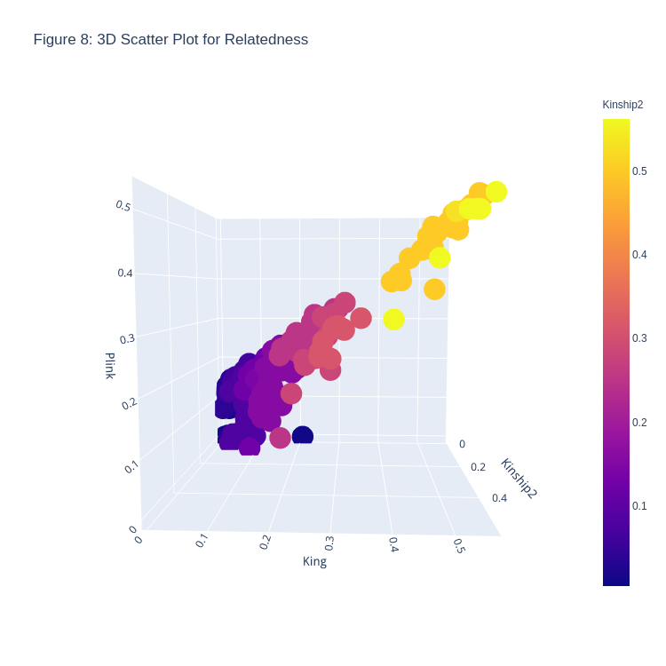
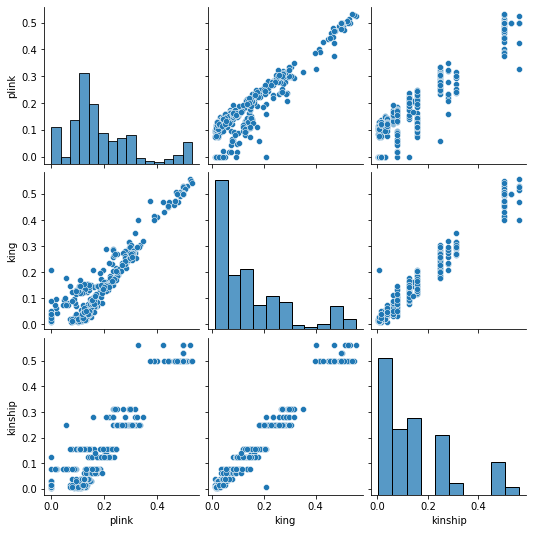

# NRI - Update 2
February 28, 2020

Helen Huang, Shivam Misra, Priya Padmanabhan, Surya Pugal,  Yixiao Yue

## Summary

We are given .bed/.fam/.bim data about individuals whom we have pedigree information for. We will feed the data into King and Plink program to calculate coefficients of relatedness (what percentage of genes between a pair of individuals is the same). Based on the percentage, we can tell whether two individuals are first degree, second degree, or not related. We will use the Kinship2 software which produces a pedigree object and output coefficients of relateness. Comparing the King and Plink values to the theoretical values produced by Kinship2, we can compare the accuracy of both of the softwares. 

### Task 1 Purpose

As per our Goal #1 (outlined in the previous update), we want to be able to figure out how many generations ago the common ancestor was for each family found in the region. Task 1's purpose was to familiarize us with the dataset for families at hand and verify the reported pedigree with genetic data. Understanding how individuals via their genetic makeup is a crucial step we need to make to be able to match genetic information with speciifc chromosomes, as is required with our first goal.

### Coefficient of Relatedness Definition

* Percentages of genes between a pair of individuals that are the same
* Larger value typically means closer relationship
* Examples:

 | Relationship | Coefficient |
 | --- | --- |
 | Parent-Offspring (OP) | 0.5 |
 | Full Siblings | 0.5 |
 | Cousins | 0.125 |

* You can read more from [Wikipedia](https://en.wikipedia.org/wiki/Coefficient_of_relationship)

## Data Processing

### King & Plink Results

**Summary**

Using the .bed/.fam/.bim data, we fed the data into these two programs, and used the linux command line to produce 2 output files.

Command for King : ` king -b InputFilename.bed --related --prefix OutputFileName `

Command for Plink : ` plink --bfile InputFileName --genome --nonfounders --out OutputFileName `

One notable thing is that for the plink command, the filename do not need any extensions.

**Format of King Outputs**

The output file has .kin extension. Each row compares the DNA of 2 individuals from the same family. We are interested in the column named "PropIBD" because it is the coefficient of relatedness. The column named "InfType" also provided useful information that infered relationship type based on PropIBD values.

**Format of Plink Outputs**

The output file has .genome extension. Each row also compares the DNA of 2 individuals from the same family. The content of the columns are different, but the coefficients of relatedness information is still there, named "PI_HAT" this time.

**Challenges**

While seemingly straight-forward at first, this task did not go smoothly. When we ran the command on our own computers, the execution always got stuck, which led us to conclude that our computers did not have enough CPU power for it. Then we set up to ssh to CNSI (California Nanosystem Institute) computers. Unfortunately, it got stuck on those computers as well. Strangely, our mentors were able to run the commands when they ssh to CNSI computers. The problems ended up being the version of the software. We downloaded the latest version which had a bug. We got an older version, and were able to got the outputs successfully.

### Kinship2 Results

**Summary**

Given the .bed/.fam/.bim data for multiple inviduals in the same family, we were asked to feed in the data into Kinship2 in order to produce a pedigree and calculate the coefficients of relatedness. This value is the percentage of genes between a pair of individuals that is the same. We then had to compare the values produced by Kinship2 with what came from the King and Plink software.

**Introduction of The Package (Kinship2)**

Kinship2 is a package in R. Accoriding to its official documentation, it is a routine to handle family data with a pedigree object. It can be used to create correlation structure that can describe family relationships, draw pedigrees focusing on producing compact layouts without intervention, trim the pedigree object with various criteria, and so forth.

For our project, we fed in the data containing family relationship and disease carrying information. With the help of Kinship2, we were able to produce the pedigree and obtain the theoretical relatedness coefficients for all pairs of individuals in the family.

**Kinship Coefficient vs. Relatedness Coefficient**

What we got from Kinship2 are the kinship coefficients. To get the relatedness coefficients, we needed to multiply the kinship coefficients by 2:

Relatedness Coefficient = Kinship Coefficient * 2

In comparison to relatedness coefficient, the kinship coefficient is defined as the probability that a pair of randomly sampled homologous alleles are identical by descent (IBD, see Update 1 for definition). In simple words, it is the probability that an randomly chosen allele selected from individual 1 and an allele selected at the same autosomal locus from individual 2 are IBD. Because humans are diploid, meaning that cells contain 2 copies of each chromosome, we need to multiply the kinship coefficient by two to get the relatedness coefficient.

**Format of Output**

Our output file produced a matrix in a similar format to the structure shown below. For example, row 3 column 2 and row 2 column 3 both contain the kinship2 coefficient of the pair id1 and id2. The values on the diagonal are all 1s because they represent the relationship  of an individual to themself. After removing the individuals who were not directly part of the family, our file reduced to a 29 by 29 matrix.

**What We Did**

1. Created a .ped (txt) file which contains the information for all the PSEN1 family members. Each individual has the information of family id, individual id, paternal id, maternal id, sex id, and phenotype info
2. Used R to read in the .ped file
3. Created a pedigree structure and plotted it
4. Created the Kinship2 coeffcient matrix
5. Multiplied all of the values by 2 (see above for why)
6. Removed all of the rows who were not fully sequenced (i.e. the individuals that we do not have their entire genome/DNA sequence)

## Data Analysis

### Comparison between Theoretical vs. Observed

Upon obtaining all the pairwise coefficients of relatedness produced by Plink and King, we compared them with the theoretical coefficient of relatedness produced by Kinship2. We analyzed them using several bar plots in order to get some insights of both the softwares we were using and the individuals/family members we were studying.

**Workflow**
* Using Kinship2 theoretical values, we divided the pairs into 16 groups where each group has a unique coefficient of relatedness (ex. All pairs with coefficient of relatedness (produced by Kinship2) equals 0.5 were grouped together)
* For each of the 16 groups, we calculated the mean and standard deviation of the coefficients produced by Plink, as well as those produced by King
* We compared those mean values with the theoretical values produced by Kinship2 (See **Figure 1**)
* We then calculated the absolute difference between Plink mean values and Kinship2 values, and between King mean values and Kinship2 values (See **Figure 2**)
* We further calculated the percent difference between Plink mean values and Kinship2 values, and between King mean values and Kinship2 values (See **Figure 3**)
* Knowing how Plink and King performed in comparison to Kinship2, we wanted to analyze how they performed compared to each other. We sorted the percent difference plot using the difference between Plink's percent difference with Kinship2 and King's percent difference with Kinship2 (See **Figure 4**)
* Since the same coefficient of relatedness value can include several types of relationship, the group with the same coefficient can be further broken down (ex. 0.5 group contains both parent/offspring and siblings relationship). We broke down the group with coefficient equals 0.5 and further analyzed how the softwares performed on each of the relationship (See **Figure 5**)

Note: Detailed rationals of why we did such analysis and created such plots, and detailed analysis of what we found out of those plots are explained below each figure

**Consanguineous Couple**

In this family, there is a marriage among relatives. There exist a couple who are cousins, meaning that they are descended from the same common ancestor. Exact individual id numbers are not shown to protect privacy. According to our analysis, Plink and King were giving interesting results whenever the individuals in the pairwise relationship are connected to this consanguineous couple in some ways, such as the children of this couple, the cousins of this couple, etc. We will be referring to this couple in the analysis below.

We decided to use bar graphs since our overarching goal was to explore the data and analyze what possible patterns exist in the data visually. We chose graphs based on our curiosity on how different visuals might lead to different results. Based on our findings, we have learned that there are other graphs that might be more appropriate (such as box plots) and we plan to explore those in future analysis.

**Figure 1. Comparison of Mean Based on Software Output**

* Goal:
    * To see how the mean of outputs of Plink and King for each coefficient compare with the theoretical values produced by Kinship2
    * Black error lines on the graph represent the standard deviation
* Key findings:
    * Outputs of all 16 relationship coefficients vary based on the software
    * Mean of the values from King are closer to theoretical than Plink (for the most part)
    * 0.53125 does not have a standard deviation line because amongst that coefficient which makes sense since all of the values produced were very similar to each other

**Figure 2. Absolute Difference of Mean Compared to Kinship2 Based on Software Output**

* Goal:
    * To see how much difference there is between King and Plink based on the coefficient of relatedness (using absolute difference)
* Math:
    * diff_plink_kinship2 = abs(kinship2coef - plink_mean)
    * diff_king_kinship2 = abs(kinship2coef - king_mean)
* Key findings:
    * King produced results which had a smaller difference from the theoretical value compared to Plink (except for when the coefficient of relatedness is 0.15625)
    *  0.15625 coefficient covers most relationships involving the couple who are cousins
        * Ex: The pair including the child of this couple with any of their cousins results in this relatedness value
    * 0.53125 produced King/Plink values whose difference was fairly close to each other
        * Represents the parent offspring relationship under the couple who are also cousins

**Figure 3. Percent Difference of Mean Compared to Kinship2 Based on Software Output**

* Goal:
    * To see how much difference there is between King and Plink based on the coefficient of relatedness (using percent difference)
* Math:
    * plink_percent_diff = (diff_plink_kinship2 / kinship2coef)
    * king_percent_diff = (diff_king_kinship2 / kinship2coef)
* Key findings:
    * Difference between King and Plink varies a lot
    * Graph does not directly give a lot of info and therefore we wanted to explore it further by sorting it by difference

**Figure 4. Sorted Percent Difference of Mean Compared to Kinship2 Based on Software Output**

* Goal:
    * Sorted Figure 3 to see if there is any pattern with regards to how King/Plink differ
* Math:
    * Sorted by difference between percent difference: abs(plink_percent_diff - king_percent_diff)
* Key findings:
    * Closer relationships (like parent/offspring and siblings) had much more similar values compared to more distant relationships (like an individual with their great-aunt)
    * Certain coefficients do not fall in this pattern (such as 0.3123 having a smaller difference than 0.5625)
    * Our hypothesis: Considering how the differences between King and Plink are very small with the coefficients that are slightly out of order, it might be negligible
        * Something to keep in mind when working with the software later

**Figure 5. Comparison of Mean Based on Software Output (0.5 Relationship)**

* Goal:
    * To split parent/offspring and siblings since they share the same coefficient and both are very close relationships
    * Other coefficients not split since 0.5 is very closely related and impacts our findings more
* Key findings:
    * Values produced by Kinship2, Plink, and King were are more similar for parent/offspring than that for siblings

## Visualization

### Heat Map

A heatmap is a visualization that shows magnitude of variables along two dimensions. We are inspired to use heatmap in this case because we have pairwise comparison data. I took the data output (2 lists), and transformed it into a 2d numpy array to feed into a Matplotlib library function.

**Figure 6. Difference between King, Plink and Theoretical Heat Map**

The red slanted line is due to the fact that the softwares do not compare an individual with herself, so it is set to an arbitary value as a boundary on the heatmap. To the left, King's output is compared with Kinship2's output, which is also the theoretical value. To the right, Plink's output is compared to Kinship2's output. The colormap is chosen to be diverging, so that yellow corresponds to zero difference to theoretical. The darker the color, the bigger the difference is. And blue is used for values higher than the theoretical, while red is used for values lower than the theoretical. Ideally, we would expect the map to look mostly yellow.

Key findings:
* King's result is closer to the theoretical because most tiles are yellow on King's side
* Plink's result is overall higher than the theoretical because most of the tiles are blue on Plink's side

### Probability Distribution Curve

The below normal probability distribution curves represent the variability of the plink, king, and kinship data respectively -- with the shaded region corresponding to existing data from the data set (data outside of this does not exist in data set).

**Figure 7. Normal Gaussian Curve for Plink, King, and Kinship2**

* Goal:
    * Map out extrema for provided dataset and observe mean/standard deviation with respect to usage of Plink, King, and Kinship2
* Key findings:
    * King and Kinship2 data look nearly identical, compared to the plink data, due to deviations in mean, standard deviation, and extrema
    * Ran two-sample z tests for comparing means between:
        1. Plink and Kinship
            * p-value: 3.077875030154161e-05
        2. Plink and King
            * p-value: 7.457103829542305e-05
        3. Kinship and King
            * p-value: 0.9424546370785375
    * p value obtained was near zero for the first two groupings
        * low p value corresponds to a low change that the means are likely the same        
    * Relatively high p value for the latter grouping
        * high p value corresponds to a high chance that the corresponding means are likely the same

### 3D Scatter Plot

**Figure 8. 3D Scatter Plot for Relatedness**

* Goal:
    * To plot the given data into a 3D Scatter plot, with Kinship2 coefficients on the x-axis, King coefficients on the y-axis, and Plink coefficients on the z-axis
        * Since Kinship2 is the recorded information on the pedigrees, they are put into the x-axis, and differences between the King and Plink coefficients can be plotted
        * If the recorded pedigree was correct, the scatter plot would feature all points on a line such that $$x=y=z$$
* Key findings:
    * Deviation from that line shows a different coefficient calculated from either King or Plink
    * The color scheme of the plot is based on relatedness - the lighter a plot is, the more related the set of individuals are, based on the Kinship2 coefficient data
    * Deviations occur usually with Plink, and that too when the relatedness coefficient is small ($<0.2$)

### Pair Plot

**Figure 9. Pair Plot for Relatedness**

The bar plots on the diagonal is a distribution of plink, king, and kinship values. The other graph is ploting two values against each other.
We expect all the scatter plots to look like $$y=x$$

Key findings:
* Distribution of king is more similar to that of kinship than plink
* plink's output for the same theoretical value has larger variance than king's output

## Conclusion
* Plink and King both overestimate and underestimate at times
* Plink deviates from theoretical values more than King
* Heatmaps itself are not enough to identify pairs of individuals whose pedigree information are incorrect, so Z-values calculation needed
* Filial relationships were easier to deduce/find from coefficient of relatedness software than manually determining said relationships

## Future Vision

Now, we have an idea about how these three softwares (Plink, King, Kinship2) work and what kind of biases they may have. We are able to make proper assumptions when utilizing these softwares in the future.

**Short Term Goals**
- Analyze all the family structures of the PSEN1 variants, and detect outliers of these variants
- Verify suspected “outliers”
- Calculate the length of the shared DNA sengment with 2 new tools (VCFTools and BCFTools)

**Long Term Vision**
- Find the common ancestors for each of the variants
- Calculate the “age” of each variant
- Perform more statistical analysis with the metadata
