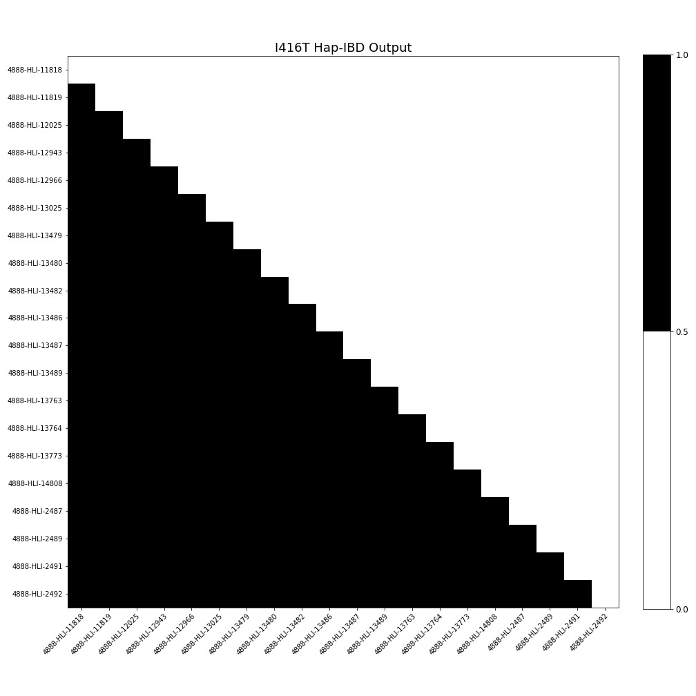

# NRI - Update 3
April 25, 2020

Helen Huang, Shivam Misra, Priya Padmanabhan, Surya Pugal,  Yixiao Yue

## Task 1 Wrap Up

As a continuation from the heatmap of I416T variant from update 2, we explored all of the other ones in the same manner to see how the values of Plink, King, and Kinship2 differed amongst them.

### PSEN1 Coefficient of Relatedness Heatmaps

Here are the final heatmaps (done at the end of last quarter) which represent the differences between the theoretical (Kinship2) values and the values produced by King and Plink. The boxes represent each family for the variants that are spread throughout multiple families. 

**E280A**

* Relatively lighter on the King side than the Plink side
* 0788 - as denoted by the arrow, contains several blue spots in its row, corresponding to very high deviation between Plink and Kinship2(theoretical)
* Diagonal - the Kinship2 value (taken to be the theoretical) was found to be 0 for comparison between one individual and another individual from another family --  however this is not to be taken as 100% accurate as kinship2 values can vary due to partial data. This means we need to make our own best guess given provided data
* Comprises of individuals from different families and is only concerned with those found to have the said mutation

**P264L**

* Observe darker discoloration in the results in the Plink, especially within the second row, corresponding to individual 0325
* Plink  may potentially be overestimating the coefficient of relatedness for that particular individual, at least with respect to the theoretical
* Other individuals of interest include 0093 and 0407, as we see in their respective rows, the contiguous orange-ish red sequence indicates a tendency to underestimate for these individuals on King’s end
* Respective column corresponding to 0407 - the orange-red color is consistent along the column and over the diagonal indicating the underestimation pattern exists for both software
* Finally, for individual 0415, the bottom most arrow, its corresponding column which is the farthest most right consists of heavy green -- Plink here highly overestimates, but King stays close to theoretical

**Other Variants with Smaller Population**

* For a number of these mutations, the discovery of their relationship with respect to Alzheimer’s has been relatively recent -- as late as 2019
    *  I162S, Q223K, I427V
* Secondly, some of the mutations have been known for a while, but were specific to certain geographic regions. For instance, the H163R mutations occurs predominantly in Japan and is not frequently observed in Columbia, where the overall datasets are pertinent to
* With regards to the heatmaps of the smaller datasets, the common trend we see is that King consistently underestimates whereas Plink consistently overestimates here, a trend which is especially pronounced by the orangish color in the lower triangles and green-bluish color in the upper triangles

## Summary

At the end of Task 1, as discussed in the above section, we have analyzed the family structures of all PSEN1 variants and calculated the coefficient of relatedness for every pair of individuals using the pedigree information given. With that, for each PSEN1 variant, we now have an idea about how each mutation-carrying individual is related to each other (ex. parent-offspring, siblings, etc.) from the **pedigree perspective**. Moving on, we are going to analyze their relationship from the **genome level**, by comparing their genome sequences, in order to finish up our Goal #1 (Calculate how many generations ago was the common ancestor for each variant).

### Task 2 Purpose
The main purpose of task 2 is to see how each mutation-carrying individual is related to others on the genome level quantitatively. As presented in Update 1, **Identical By Descent (IBD)** describes that two or more individuals share similar nucleotide sequences and inherit that shared segment from a common ancestor; thus, IBD length is correlated with historical relationship. So in task2, we are going to calculate the length of the shared DNA segment (IBD length) of each pair of individual, and analyze the historical relationship based on that.

## Software

### VCFtools

VCFtools is a suite of functions for use on genetic variation data in the form of VCF and BCF files. The tools will be used to process genetic data, run calculations, and is able to convert the data into other useful file formats. A manual of the tools can be found on this [website](https://vcftools.github.io/man_latest.html).

### Hap-IBD

The Hap-IBD program detects IBD segments in phased genotype data. The Hap-IBD program can analyze data sets with hundreds of thousands of samples. You can read more about this method from this [paper](https://doi.org/10.1016/j.ajhg.2020.02.010).

## Data
### Phased VCF Files
* Contains phased genetic data including chromosome, haplotypes of the individuals

### Hap-IBD Files
* Contains genetic data including chromosome and IBD information
* To be used in the Hap-IBD program

## Data Processing

The tools we made use of include vcftools, as well as plink, king, and kinship2 from the earlier updates. We obtained an excel file which contains pairs of individuals of interest, along with their corresponding haplotypes, IBD lengths (in terms of unit known as centimorgans), and start and end points of the commonly shared segments within nucleotide sequences. We were also with a text file containing the variants associated with certain families.

## Data Analysis

Using the files, we looked at which individuals were carriers of genetic Alzheimer's. To do this, we looked at 1) if they were labeled as having the same haplotype and 2) if the segment overlapped with the region corresponding to the PSEN1 mutation (73603143 to 73690399). We also had to re-do some of our analysis after meeting with our PI after we found that some of the carriers did not match with what was expected, which we determine to be the result of looking at other non-significant individuals.

## Visualization

This set of visualization is aiming to answer the question that "Do we find all the expected IBD mutation carrying segment"? The results are presented in a heatmap/matrix format. Shown on both axises are the mutation-carrying individuals of the specific variant; for each pair of individuals, **black** represents that we do find the expected IBD segment whereas **white** represents that we do not find the expected IBD segment.

**I416T**

For all the pairs of individuals that we expect to see an IBD relationship, we do observe that in the Hap-IBD output. Per the heatmap, all pairwise relationship are black (meaning have the IBD relationship). In addition, becasue only one family has this mutation, we do not worry about any relationship across families.

**E280A**

Considering how there are multiple families who carry this mutation, it is natural that not all pairs of individuals have an IBD relationship. To see if there was a pattern in terms of each individual family, the individuals were sorted based on family ID. Each red square represents a family. It appears that even within each family, not all individuals have an IBD relationship. The reasoning behind why this is the case will need to be investigated further.

