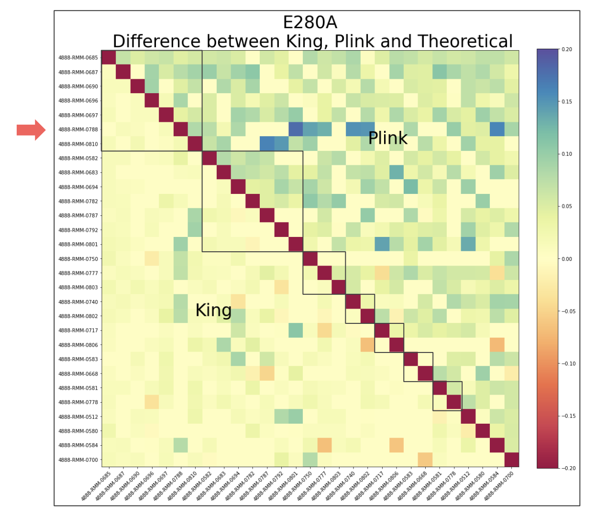
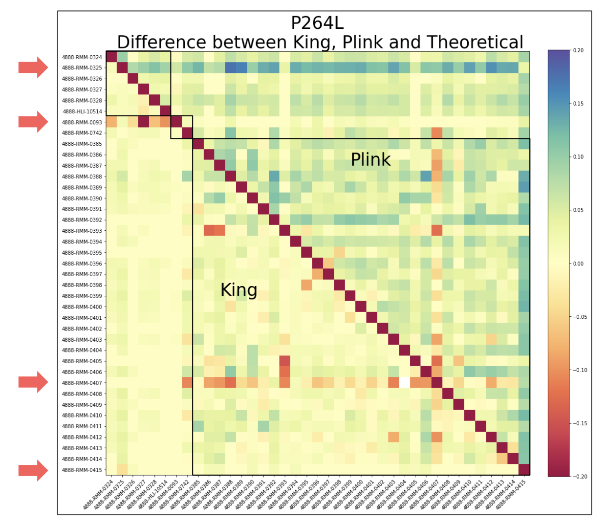

# NRI - Update 3
April 25, 2020

Helen Huang, Shivam Misra, Priya Padmanabhan, Surya Pugal,  Yixiao Yue

## Task 1 Wrap Up

As a continuation from the heatmap of I416T variant from update 2, we explored all of the other ones in the same manner to see how the values of Plink, King, and Kinship2 differed amongst them.

### PSEN1 Coefficient of Relatedness Heatmaps

Here are the final heatmaps (done at the end of last quarter) which represent the differences between the theoretical (Kinship2) values and the values produced by King and Plink. The boxes represent each family for the variants that are spread throughout multiple families. 

**E280A**

* Relatively lighter on the King side than the Plink side
* 0788 - as denoted by the arrow, contains several blue spots in its row, corresponding to very high deviation between Plink and Kinship2(theoretical)
* Diagonal - the Kinship2 value (taken to be the theoretical) was found to be 0 for comparison between one individual and another individual from another family --  however this is not to be taken as 100% accurate as kinship2 values can vary due to partial data. This means we need to make our own best guess given provided data
* Comprises of individuals from different families and is only concerned with those found to have the said mutation

**P264L**

* Observe darker discoloration in the results in the Plink, especially within the second row, corresponding to individual 0325
* Plink  may potentially be overestimating the coefficient of relatedness for that particular individual, at least with respect to the theoretical
* Other individuals of interest include 0093 and 0407, as we see in their respective rows, the contiguous orange-ish red sequence indicates a tendency to underestimate for these individuals on King’s end
* Respective column corresponding to 0407 - the orange-red color is consistent along the column and over the diagonal indicating the underestimation pattern exists for both software
* Finally, for individual 0415, the bottom most arrow, its corresponding column which is the farthest most right consists of heavy green -- Plink here highly overestimates, but King stays close to theoretical

**Other Variants with Smaller Population**

* For a number of these mutations, the discovery of their relationship with respect to Alzheimer’s has been relatively recent -- as late as 2019
    *  I162S, Q223K, I427V
* Secondly, some of the mutations have been known for a while, but were specific to certain geographic regions. For instance, the H163R mutations occurs predominantly in Japan and is not frequently observed in Columbia, where the overall datasets are pertinent to
* With regards to the heatmaps of the smaller datasets, the common trend we see is that King consistently underestimates whereas Plink consistently overestimates here, a trend which is especially pronounced by the orangish color in the lower triangles and green-bluish color in the upper triangles
