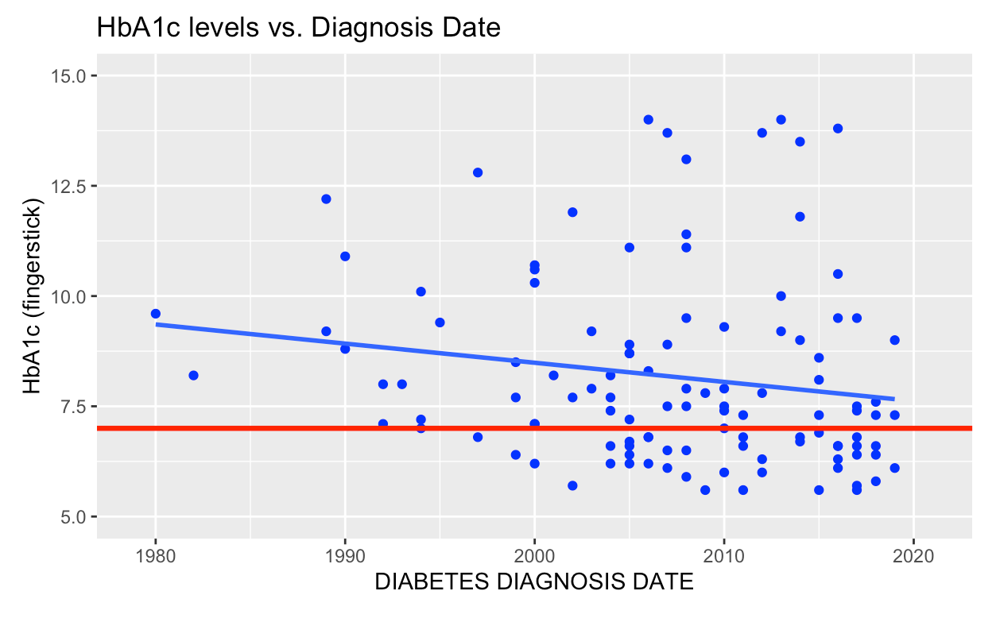
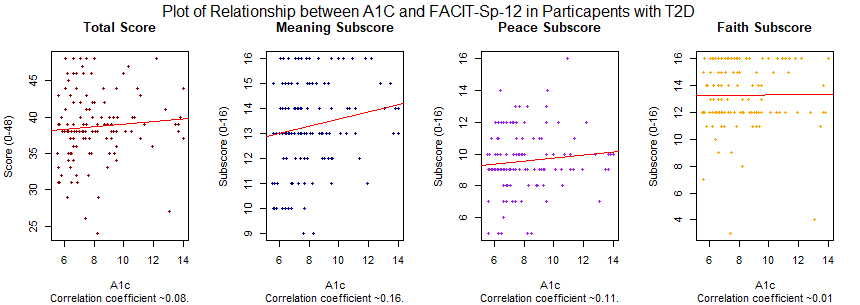

---
jupytext:
  text_representation:
    extension: .md
    format_name: myst
    format_version: 0.12
    jupytext_version: 1.9.1
kernelspec:
  display_name: Python 3
  language: python
  name: python3
---

+++ {"id": "jrLNyrPWantJ"}

# Update 2


Capstone members
- Lawrence Lin, Zoe Holzer, Emily San Juan, Jake Simon, Vanessa Salgado

Faculty
- Alexander Franks, Jiajing Zheng, Dr. Namino Glantz, Dr. David Kerr

+++ {"id": "n9bxvcswantQ"}

### Things we’ve done since last progress report: 
- Scoring Qualitative Survey Answers
    - Using the scoring rubric to assess scores for survery responses 
    - e.g. for the Social Needs survey, we would assess a score from all the responses that would tell us what the social needs of an individual
    - Another exmaple: Scoring how religious/ spiritual someone is based off of meaning, peace, and faith
- Addressing missing data
    - Asking questions about missing data
    - Removing missing rows and columns
- Exploratory Data Analysis
    - Compared HbA1c levels to other variables of interest such as whether they have been treated with insulin

+++

### A quick refresher: 
Data:

- Approximately 230 individuals
- Each individual participant contributes
information on up to 100 different variables relating to their genetics, biology,
psychology, behavior and societal/environmental influences

Examples of influences measured
- Genetic: 

    - blood sample
    - saliva sample

- Biological: 

    - HbA1c levels
    - vital signs
    - medical history

- Psychological: 

    - Depression (PHQ-9: Patient Health Questionnaire)
    - Spirituality (FACIT-Sp-12: Spiritual Well-Being Scale)

- Behavioral: 

    - Sleep (OSQ: Oveido Sleep Questionnaire)
    - Diet
    
- Social-Environmental:

    - Demographic information 

Relevant Jargon:

- Type 2 Diabetes (T2D): Type 2 diabetes is an impairment in the way the body regulates and uses sugar (glucose) as a fuel. This long-term (chronic) condition results in too much sugar circulating in the bloodstream. Eventually, high blood sugar levels can lead to disorders of the circulatory, nervous and immune systems.
- HbA1c (Hemoglobin A1c): A minor component of hemoglobin (the protein in red blood cells that carries oxygen to the body's tissues) that binds with glucose. HbA1c blood tests are commonly used to measure average blood sugar levels and diagnose diabetes. HbA1c levels are given as a percentage of hemoglobin proteins that are coated with sugar. 

- Five Determinants of Health: Genetic, Biological, Behavioral, Psychological, and Societal/Environmental factors.

Background:

Diabetes is the fifth leading cause of death among Latino Americans. Almost 1 in 2 Latino adults are at risk of type 2 diabetes. Recent data from the CDC shows that diabetes rates are twice as high for Latinos of Mexican heritage compared with Whites. This excess burden of diabetes is due to complex, poorly-understood interactions between determinants of health. Some of these include economic challenges, cultural/language/health literacy barriers, pollution, etc. Many of these factors are beyond traditional biological factors; by learning more about these relationships we can identify interventions that can target diabetes outside of traditional clinical options.

+++

### Analysis Strategy

We trichotomized individuals by HbA1c levels. These classes represent an individual's risk of complications from diabetes, based off recommendations from the American Diabetes Association. 

|HbA1c Class|HbA1c levels|Risk level|Description|
|-----------|------------|----------|:----|
|     0     |      <7%   | Low Risk |No diabetes, pre-diabetes, or diabetics who are able to control their a1c levels with insulin      |
|1|7-9%|Moderate risk|Poor control over diabetes; at risk for complications with heart, kidney, and eyes|
|2|>9%|High risk|A1c levels are critically high; Undiagnosed diabetes patients or when current diabetes management is inadequate|

Through data visualizations and linear regressions, we attempted to discover a relationship between features and categorical HbA1c class or the numerical HbA1c level.

+++

### Exploratory Data Analysis:

+++

```{image} ../visuals/pca.png
:alt: pca
:width: 250px
:heigh: 250px
:align: center

We projected the biological data into three-dimensions and plotted the color-coded points to see if we could identify any trends between the HbA1c classes. There were no clear patterns in this 3D plot.
```

+++


The histograms above compare the distribution of HbA1c levels of participants treated with Insulin during research and participants not treated during research. The vertical red bar indicates the point at which HbA1c = 7, giving a better view to the distribution of individuals with lower or higher values than 7. Surprisingly, the individuals not treated have lower HbA1c levels, having a skewed right distribution when compared to their treated counterparts. This could be due to the treated participants having a greater need for Insulin, or could be due to the lower number of participants being treated than not being treated.

+++ {"id": "YyJ3pMindCd4"}


We stratified the data set into three different tiers of HbA1c levels and plotted their distribution by zipcode. We found a higher proportion of high-risk individuals  in the 93101 and 93117 zip codes. A possible explanation could be the lower air quality in these zip codes.

+++



The scatter plots display the HbA1c levels of participants over the years based on year of diagnosis. The left plot displays participants treated for insulin during research, while the right plot displays the participants not treated for insulin during research. Both graphs have a solid red bar at the level HbA1c = 7, displaying the two groups used to categorize HbA1c so far in our research. As the years get closer to present day, there is a noticeable negative correlation between diagnosis and HbA1c for both graphs. While the treated group has a higher HbA1c levels for its slope, both groups seem to have a similar slope based on the angle of line depicted in each graph. When measuring the correlations for each group, the treated group had a correlation of -0.065, while the non-treated group had a correlation of -0.052. While separated, the two groups do not produce significant correlations, but when combined they produce a significant correlation with a value of -0.242.

+++



FACIT-Sp-12 stands for “Functional Assessment of Chronic Illness Therapy - Spiritual Well-Being 12 Item Scale”. There are three subscores when using the 3-Factor model: meaning, peace and faith. Higher scores imply better spiritual well being. These plots show the differences between the correlation and stratification of A1c in relation to both the FACIT-Sp-12 total score and subscores. 
These results were surprising to us because we expected a negative correlation between spiritual wellbeing and A1c if any, however the correlations between all scores were positive. It appears that most individuals had high faith scores, but that the meaning subscore actually increased a fair amount with A1c. This could possibly be because as the disease worsens, participants start to find ‘acceptance’ in the absence of initial shock. 
To explore this result more, we are planning to perform the same test when stratified by both diagnosis date and whether the participant was treated with insulin.

+++ {"id": "UpDEkszbantR"}

### Summary
What worked: 
- Linear Regression
    - Found negative correlation between diagnosis date and HbA1c level
    - Found positive correlation between faith and HbA1c levels
- Data visualization
    - Noticed pattern between zip codes and HbA1c class
    - Noticed pattern in the HbA1c levels of insulin treated vs not insulin treated individuals
    
What did not work:
- Principle Components Analysis
    - PCA on biological data of observations did not yield any noticeable relationships

+++ {"id": "RNC7vrIYantS"}

### Hopes for the future
- Further analyzing questionnaires
- Prediction of HbA1c class

```{code-cell}

```
