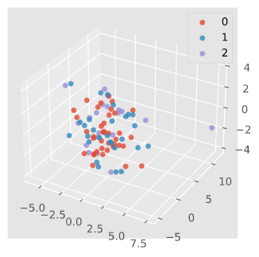

---
jupyter:
  jupytext:
    text_representation:
      extension: .md
      format_name: markdown
      format_version: '1.2'
      jupytext_version: 1.9.1
  kernelspec:
    display_name: Python 3
    language: python
    name: python3
---

<!-- #region id="jrLNyrPWantJ" -->
# Update 2


#### Capstone members
- Lawrence Lin, Zoe Holzer, Emily San Juan, Jake Simon, Vanessa Salgado

#### Faculty
- Alexander Franks, Jiajing Zheng, Dr. Namino Glantz, Dr. David Kerr
<!-- #endregion -->

<!-- #region id="n9bxvcswantQ" -->
#### Overview of our progress: 
- Exploratory Data Analysis
    - Compared HbA1c levels to other variables of interest such as whether they have been treated with insulin
    - Addressing missing data
      - Asking questions about missing data
      - Removing missing rows and columns
    - Scoring Qualitative Survey Answers
      - Using the scoring rubric to assess scores for survery responses 
      - e.g. for the Social Needs survey, we would assess a score from all the responses that would tell us what the social needs of an individual
      - Another exmaple: Scoring how religious/ spiritual someone is based off of meaning, peace, and faith
- Database Management
  - Using REDCap cloud to store and manage research data 

<!-- #endregion -->

<!-- #region id="YyJ3pMindCd4" -->


We stratified the data set into three different tiers of HbA1c levels and plotted their distribution by zipcode. We found higher HbA1c levels in the 93101 and 93117 zip codes. A possible explanation could be the lower air quality in these zip codes.


<!-- #endregion -->


The histograms above compare the distribution of HbA1c levels of participants treated with Insulin during research and participants not treated during research. The vertical red bar indicates the point at which HbA1c = 7, giving a better view to the distribution of individuals with lower or higher values than 7. Surprisingly, the individuals not treated have lower HbA1c levels, having a skewed right distribution when compared to their treated counterparts. This could be due to the treated participants having a greater need for Insulin, or could be due to the lower number of participants being treated than not being treated.


The scatter plots display the HbA1c levels of participants over the years based on year of diagnosis. The left plot displays participants treated for insulin during research, while the right plot displays the participants not treated for insulin during research. Both graphs have a solid red bar at the level HbA1c = 7, displaying the two groups used to categorize HbA1c so far in our research. As the years get closer to present day, there is a noticeable negative correlation between diagnosis and HbA1c for both graphs. While the treated group has a higher HbA1c levels for its slope, both groups seem to have a similar slope based on the angle of line depicted in each graph. When measuring the correlations for each group, the treated group had a correlation of -0.065, while the non-treated group had a correlation of -0.052. While separated, the two groups do not produce significant correlations, but when combined they produce a significant correlation with a value of -0.242.


These plots show the differences between the correlation and stratification of A1c in relation to both the total FACIT-Sp-12 score and the FACIT-Sp-12 meaning subscore. FACIT-Sp-12 stands for “Functional Assessment of Chronic Illness Therapy - Spiritual Well-Being 12 Item Scale”. There are three subscores when using the 3-Factor model: meaning, peace and faith. The meaning subscore had a substantially higher correlation coefficient at around ~0.16 then the total score, which had a correlation coefficient of around ~0.08. The faith subscores, in contrast, had correlation coefficients




We projected the biological data into three-dimensions and plotted the results by HbA1c class to see if we could identify any patterns in the data. There were no clear patterns in this 3D plot.

<!-- #region id="NESXWU68antR" -->
#### RedCap:
1. Enrolling and Data Capture: 	
  - Screening IDs are automatically generated on enrollment
  - Subject IDs assigned to a patient/subject are their unique identifier during a Study
  - "Confirm enrollment" (if enabled in Parameters), enables a user to enroll a subject even if they do not qualify based on their screening results
  - All Subjects don’t need to be screened for eligibility prior to enrollment but can be
2. Data Export, Reporting, Audit Logs:
  - The Send It module can be used to send large (up to 500MB) and/or sensitive files to one or more recipients in a HIPAA compliant manner
  - After clicking submit report in “Report Wizard”, the report can be exported into either CSV or Excel
3. Intermediate Reporting:
  - In Report Wizard, a user can save a report as a Shared Report for access to other Users
  - A user can configure their reports by selecting fields to include in their report from the drop-down of instruments
  - When searching for a specific report, a user can either use the search bar or click “filter” and use: is, is not, starts with, contains, is empty, or is not empty
4. Surveys:
  - Surveys (if enabled) will allow for an alternative data capture medium for the Study Team by enabling data capture direct from Subjects via a Survey URL
  - There are four ways a Survey can be launched, and an email generated to (Study enrolled) Survey participants with a URL to access it
  - Survey Queue displays a list of ALL surveys in the Study on a single person
  - Surveys can be set to appear in the Survey Queue based upon if the participant has completed a particular survey and/or if certain conditions are met (based upon data values)
  - Public Surveys can be used for the general public for teaching purposes, such as Health Fairs, Company Parties, or School Lectures, where the study team could make a laptop(s) available for attendees to enter data anonymously
5. Monitoring:
  - Monitoring consists of 3 separate components which are:
    - Source Data Verification – CRF(Case report form) or fields within the CRF which require verification to source documents by the field/site monitor.
    - Medical Review – CRF or field data requires review by e.g. a medical reviewer.
    - Data Review - CRF or field data which require review by a data manager.
  - An Event cannot be closed out if monitoring has not been completed on any of the 'Required' CRFs that requiring monitoring
6. E-signature process:
  - The icon for eSignature will show up next to the form; as well as, the Event level, as long as the role for the user has been enabled
  - When the forms have been completed, the user with the ability to eSign, will click on the icon and enter their password
  - eSignatures can be erased and “resigned” if necessary


<!-- #endregion -->

<!-- #region id="UpDEkszbantR" -->
#### Summary 
- We have been finding variables that are correlated with A1c 
- Determined that our next step is to explore our data while controlling for time since diagnosis and the insulin treated variable
- Familiarized ourselves with REDCap 


<!-- #endregion -->

<!-- #region id="RNC7vrIYantS" -->
### Future goals
- Analyzing qualitative data
- Predicting A1c Classes
- Entering research data into the RedCap database

<!-- #endregion -->

```python

```
