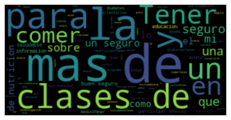

---
jupyter:
  jupytext:
    text_representation:
      extension: .md
      format_name: markdown
      format_version: '1.2'
      jupytext_version: 1.9.1
  kernelspec:
    display_name: Python 3
    language: python
    name: python3
---

<!-- #region id="jrLNyrPWantJ" -->
# Update 3


Capstone members
- Lawrence Lin, Zoe Holzer, Emily San Juan, Jake Simon, Vanessa Salgado

Faculty
- Alexander Franks, Jiajing Zheng, Dr. Namino Glantz, Dr. David Kerr
<!-- #endregion -->

<!-- #region id="n9bxvcswantQ" -->
### Things we’ve done since last progress report:
Data Analysis:
- Ran Wilcoxon tests on features with two responses
- Began working on a wordcloud to visualize survey responses
- Created report on insulin treated individual A1c levels
- Created report on FACIT-Sp12 (Spirituality questionnaire) and A1c levels
- Analyzed HbA1c levels using individual predictors/questions from questionnaires
- Fit some linear models to the data
- Clustering
- Correlations
    - Found new correlations w/ A1c with participants who take birth control and participants with previous instructions on how to care for diabetes

Data Processing:
- Created data cleaning script 

Documentation:
- Updated Rmarkdown files and notebooks to include commentary
- Created makefile to install project dependencies and run data cleaning script


<!-- #endregion -->

### A quick refresher: 
Data:

- Approximately 230 individuals
- Each individual participant contributes
information on up to 100 different variables relating to their genetics, biology,
psychology, behavior and societal/environmental influences

Relevant Jargon:

- Type 2 Diabetes (T2D): Type 2 diabetes is an impairment in the way the body regulates and uses sugar (glucose) as a fuel. This long-term (chronic) condition results in too much sugar circulating in the bloodstream. Eventually, high blood sugar levels can lead to disorders of the circulatory, nervous and immune systems.
- HbA1c (Hemoglobin A1c): A minor component of hemoglobin (the protein in red blood cells that carries oxygen to the body's tissues) that binds with glucose. HbA1c blood tests are commonly used to measure average blood sugar levels and diagnose diabetes. HbA1c levels are given as a percentage of hemoglobin proteins that are coated with sugar. 

- Five Determinants of Health: Genetic, Biological, Behavioral, Psychological, and Societal/Environmental factors.

Background:

Diabetes is the fifth leading cause of death among Latino Americans. Almost 1 in 2 Latino adults are at risk of type 2 diabetes. Recent data from the CDC shows that diabetes rates are twice as high for Latinos of Mexican heritage compared with Whites. This excess burden of diabetes is due to complex, poorly-understood interactions between determinants of health. Some of these include economic challenges, cultural/language/health literacy barriers, pollution, etc. Many of these factors are beyond traditional biological factors; by learning more about these relationships we can identify interventions that can target diabetes outside of traditional clinical options.


### Data Analysis




This is a wordcloud generated from question 5 of the introductory survey for the Mil Familias cohort. The question is, "What things would make it easier for you to ask for help and manage your diabetes?". Although many of the prepositions, articles, and conjunctions need to be cleaned from the text, we can see the general sentiment is that diabetes education is important.


We also used the K-Means algorithm with n_clusters = 2 on four variables:
- hemoglobin_a1c
- TPS Score: Trust in Physician Score. Higher values indicate more trust in the healthcare system
- PHQ-9 Score: Patient Health Questionnaire-9 Score. Higher values indicate higher degree of depression of severity. 
- Food Sec. Score: Food Security Survey Module Score. Higher values indicate more food security.

The results were as follows:
```
Cluster 0
hemoglobin_a1c mean: 0.42345373951567106
TPS Score mean: -0.763998821521518
PHQ-9 Score mean: 0.5566759386845319
Food Sec. Score mean: 1.0408397676503365


Cluster 1
hemoglobin_a1c mean: -0.19501159056642803
TPS Score mean: 0.3518415625428033
PHQ-9 Score mean: -0.25636391913103446
Food Sec. Score mean: -0.4793341035231811
```

We can see that higher hemoglobin a1c levels awere associated with less trust in physicians, more severe depression, and more food security.


Furthermore, we performed a linear regression with hemoglobin a1c as the dependent variable and nineteen handpicked explanatory variables that summarized an individual's genetic, biological, psychological, behavioral, and societal/environmental features. The full list of explanatory variables is below.

```python
variables = ["PSS-4 Score", "ACE Score", "PEDQ Score", "PHQ-9 Score", "FACIT Score",
"SAHL-E Score", "NVS Score","TPS Score", "mMOS Score", "SNT Score", "Food Sec. Score",
"BASH Score", "WC (in)", "Height (in)", "Weight (lbs)", "Pulse", "Heart Failure", "SEX/GENDER", "AGE"]
```

```python tags=["remove-input"]
import pickle
with open("../data/processed/ols.pickle","rb") as read_file:
     results = pickle.load(read_file)
```

```python tags=["remove-input"]
results
```

Here we can see that the model is not significant, as shown by the F-statistic and the negative adjusted R-squared. However, we can see that the pulse variable (x16) at least appears to have a stronger affect on hemoglobin a1c.


### Plans for the future:
- Train a random forest model to predict A1c
- Further analyze correlations
- Break down questionnaire forms by question when analyzing correlations

```python

```
